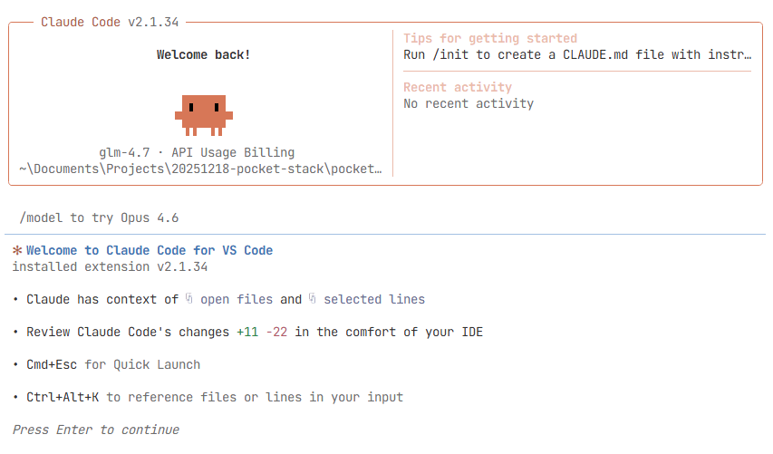

# Claude Code 安装和 GML 模型配置

本文在windows环境验证通过。

## 安装 Claude Code

```bash
npm i -g @anthropic-ai/claude-code
```

启动

```bash
cd projectDir
claude
```

国内环境启动会报错。下面的步骤可以解决该问题。

## 注册智谱大模型

进入智谱官网：https://open.bigmodel.cn/

注册，添加新的API KEY。

## 配置Claude Code

1. 进入用户目录，例如`c:\Users\your-name`
2. 用文本编辑器打开`.claude.json`
3. 在json中添加以下内容

```json
  "hasCompletedOnboarding": true,
  "env": {
	"anthropic_base_url": "https://open.bigmodel.cn/api/anthropic",
	"anthropic_api_key": "你的API KEY",
	"anthropic_model": "glm-4.7"
  },
```

保存后重新启动命令行工具，再次输入`claude`命令，就可以看到欢迎界面了。

