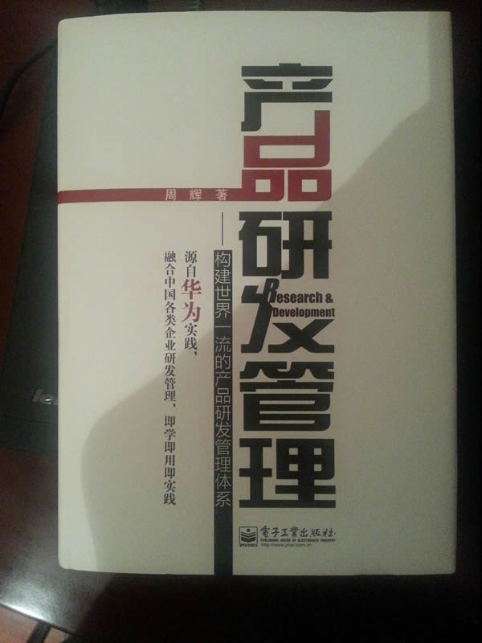

# 《产品研发管理》读书笔记

产品有两个研究对象，一是市场，一是技术。这本书其实讲的是产品和技术管理的常识。我认为在一家技术公司，人人都应该了解产品，也应该对技术管理有最起码的认知。

摘几个要点，加黑是原文，浅色是我的笔记：

## 产品战略的主体是CEO

**产品战略要结合公司战略综合考虑市场和核心技术以及平台和人员能力提升以及资源配置策略，其责任主体是公司CEO而不是研发负责人。** 

产品战略要先于产品而行，且在公司战略、市场、技术、人员等条件和资源之间平衡。责任主体不仅有责任，而且必须充分了解和掌控这些资源，才能担负起产品策略的责任。

## 落后和领先的产品规划

**企业落后时，不要花太多精力做规划，主要瞄准对手，在技术和客户关系上进行突破超越；企业领先时，要进行市场和营销分离，将懂业务和需求的研发人员放到市场，以牵引和规划客户需求，快速形成产品，确保持续领先。** 

看似保守，其实是市场博弈的最优策略。

## 技术要服务于产品

**并不是技术越多越好，而是越具有核心技术越好，企业预研必须基于核心技术进行立体研发，反对核心技术外包。** 

所谓技术，实在太宽泛了。互联网圈里不尊重技术的现象，其实是技术泛化的结果。产品的核心，不是快餐技能，而是核心技术。是你有别人所不能有的，你能做别人所不能做的。是算法，是专利，是独家。这种技术才值得格外的尊重和保护。

## 公司高层要亲自负责产品前三单的销售

**产品命名、商标及样板点建设和产品前三单销售是产品开发团队的责任，公司高层前期要多参与产品营销的策划，设计买点和建立样板点，并亲自负责前三单的销售。** 

产品营销策划、初期销售策略，在产品设计阶段就应进行充分考虑。而设计和销售应该有连续性，所以强调产品团队和公司高层必须跟踪全程，特别是产品定位和初期销售两个节点，是把控产品的最重要的时机。

## 产品质量是不是测试出来的，而是设计出来的

**研发质量管理不是事后缺陷管理，而是在产品设计时综合考虑CBB（共享产品货架，相当于代码库）、评审、测试和验证以及归零管理和人岗匹配五种手段……**

都不是纯粹的理论，无论大公司还是小团队，在产品控制的流程上应该是节点吻合的。关键是执行。比如产品质量管理，如何在我们的团队实现事前管理？答案很简单，就是做好验收标准和测试用例。

## 要在产品规划时就想好买点，没买点的产品就不要开发

**卖点在开发时就应该设计，以此指导产品开发选择什么样的功能和技术，以区别竞争对手，避免同质化的竞争。** 

卖点是设计出来的，但设计的原则是用户需求。做好需求研究后才能考虑产品的市场定位、竞争对手、竞争策略、领先优势等等。

## 不需要追求非利润客户的满意度

**客户满意度并不是以为追求越高越好。非利润客户满意度甚至可以低于50%。** 

非利润客户是指给公司带来的利润小于机会利润甚至不赚钱的客户。如果套用在产品设计上，那么这部分用户就不属于预期用群。
