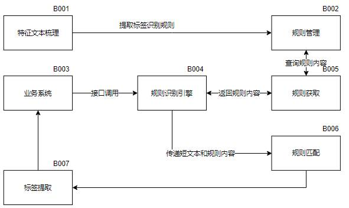

# 一种基于逻辑表达式的短文本标签识别方法

本发明公开了一种基于逻辑表达式的短文本标签识别方法，具体操作步骤如下：步骤一、规则提取；步骤二、规则管理；步骤三、规则获取；步骤四、标签识别；步骤五、标签提取。基于对业务的深入理解，梳理出标签提取的特征，将这些特征转换成逻辑表达式，并对梳理出来的逻辑表达式进行管理，应用这些逻辑表达式，可以对业务相关的短文本自动进行标签识别，这些标签将以文本属性的形式存在。本方法可应用于全领域文本的结构化提取、全领域文本的自动分类以及智能推荐系统的自动标签识别等场景，具有应用领域广，识别效率高、人工成本低等优势。

## 技术领域

本发明涉及文本的自然语言处理技术和文本标签分类方法。

## 发明目的

目前短文本的自然语言处理技术越来越重要，文本分析需要有一定的语料基础，通过已有标签的语料去分析要解决的文本内容。在处理大量的文本之前，通常需要人工去标记一定量的文本数据，比如标记该文本的主题，分类等。这是一个非常耗费时间的过程。本发明的目的是提供一种针对短文本进行关键词包含逻辑规则匹配的标签识别的方法，本发明解决短文本标签识别、文本分类的问题。此方法需要针对业务梳理规则，通过定义的规则调用规则识别引擎进行标签匹配，实现对文本标签归类处理，规则定义支持逻辑表达式，支持逻辑与或非的配置。基于逻辑表达式的标签识别方法方式通过文本规则的梳理、逻辑表达式规则的制定，在大量的短文本应用中测试，验证了该算法的有效性。

本方法可应用于文本的标签提取、文本的自动分类、非结构化转结构化，以及智能推荐系统的自动标签识别等场景，具有应用领域广，识别效率高、人工成本低等优势。

## 背景技术

本发明中使用关键词包含逻辑规则进行文本标签匹配，关键词包含逻辑规则是对指定文本进行是否包含相关关键词的逻辑判断功能。运算符包括：“()”定义优先级、“&&”定义与关系、“||”定义或关系、“!”定义非关系。逻辑运算表达式是由逻辑运算符与“true”、“false”组合而成的可以在逻辑表达式引擎中可以运行的表达式，逻辑表达式引擎解释执行逻辑表达式。

“逻辑运算,又称布尔运算。布尔用数学方法研究逻辑问题,成功地建立了逻辑演算。他用等式表示判断,把推理看作等式的变换。这种变换的有效性不依赖人们对符号的解释,只依赖于符号的组合规律 。这一逻辑理论人们常称它为布尔代数。

在短文本标签提取场景中，监督学习的分类方法标签范围不能灵活选取，无监督学习的关键词抽取方法，如 TFIDF 方式提取标签又缺乏文档的覆盖率。而通过基于逻辑表达式的标签识别方式，能灵活的识别关键词标签，识别的标签兼顾关键词的区分度和覆盖率。

## 发明内容

本发明公开了一种基于逻辑表达式的短文本标签识别方法，目前短文本的自然语言处理技术越来越重要，文本分析需要有一定的语料基础，通过已有标签的语料去分析要解决的文本内容。在处理大量的文本之前，通常需要人工去标记一定量的文本数据，比如标记该文本的主题，分类等。这是一个非常耗费时间的过程。本发明的目的是提供一种针对短文本进行关键词包含逻辑规则匹配的标签识别的方法，本发明解决短文本标签识别、文本分类的问题。此方法需要针对业务梳理规则，通过定义的规则调用规则识别引擎进行标签匹配，实现对文本标签归类处理，规则定义支持逻辑表达式，支持逻辑与或非的配置。基于逻辑表达式的标签识别方法方式通过文本规则的梳理、逻辑表达式规则的制定，在大量的短文本应用中测试，验证了该算法的有效性。

本方法可应用于文本的标签提取、文本的自动分类、非结构化转结构化，以及智能推荐系统的自动标签识别等场景，具有应用领域广，识别效率高、人工成本低等优势。

一种基于逻辑表达式的短文本标签识别方法，包含规则提取、规则管理、规则调用、规则解析、标签提取五个部分。通过对领域内大量文本的解读，分别为每一个标签梳理出一套特征文本，对这些特征文本进行分析，提取出核心文本，转化为逻辑表达式，作为这个标签的识别规则。在标签识别管理中，管理这些逻辑表达式。每一个标签都会有一个专属的标签识别库，这个识别库下管理着这个标签相关的全部逻辑表达式，这些逻辑表达式也被称为标签识别规则。业务系统通过调用提供的标签识别服务接口，将所需要的标签识别库及标签识别规则传递给规则识别引擎。规则识别引擎根据传递过来的标签识别库及标签识别规则去数据库中查询规则数据并放到内存中。应用规则识别引擎依次将逻辑表达式（识别规则）与业务文本进行匹配并提取，最终匹配上的标签就是文本所属于的分类。

## 本发明具有如下有益效果

基于对领域内大量文本的解读，分别为每一个标签梳理出一套特征文本。

引入逻辑表达式、规则识别引擎等技术，与业务知识相融合，实现短文本标签的自动识别。

解决了标签体系建立难的问题。基于逻辑表达式的短文本标签识别方法是具体方法：首先需要深入解读业务领域内相关的短文本；其次要深刻理解标签的含义以及特征，并在这些短文本中提取出标签的特征文本；再次基于这些特征文本转换成逻辑表达式，使逻辑表达式能够全部覆盖特征文本，从而完成一套业务领域专属的标签体系的建立。

解决了短文本标签识别准确率低的问题。具体方法：在进行逻辑表达式匹配的时候，校验逻辑表达式的语法是否符合规范，确保逻辑表达式的正确后，将逻辑表达式以逻辑运算符&、|、!、(、)作为分隔符，将逻辑表达式进行拆分，生成逻辑表达式的关键词，循环应用这些关键词在短文本中进行查询，关键词存在于短文本中，记录为True，关键词在短文本中不存在，则记录为False；以关键词在文本中的查找结果替换对应的关键词，带入到逻辑表达式中，计算表达式结果。

本发明公开了一种基于逻辑表达式的短文本标签识别方法，一种通用的短文本标签识别方法，可应用全领域文本的结构化提取、全领域文本的自动分类以及智能推荐系统的自动标签识别、自动分类和识别的标签体系建设等场景，具有应用领域广、技术门槛低、准确率高等优势，具有非常良好的发展前景。

## 具体实施方式

以下结合附图和实例对本发明的实施作进一步说明，但本发明的实施和保护不限于此。

如图1-识别方法总体架构图所示，具体包括：规则提取、规则管理、规则获取、标签识别、标签提取。

### 步骤一、规则提取

学习领域专业知识，对领域有较深入的理解；梳理业务领域内有哪些标签需要自动化识别；解读领域内业务相关的短文本，分别为每一个标签梳理出一套特征文本，对这些特征文本进行分析，提取出核心文本，转化为标签识别规则。标签识别规则的编写需要符合逻辑表达式的语法规则：以&代表与的关系，以|代表或的关系，以!代表非的关系，支持以英文括号，提升运算符的优先级。

### 步骤二、规则管理

为每一个标签分别创建一个标签识别规则库，用于存放每一个标签的识别规则，在这个库下，依次将步骤一提取的标签识别规则添加到对应的标签识别规则库中；可以对已添加的标签识别规则库以及规则进行修改和删除，便于对识别规则进行维护。

### 步骤三、规则获取

规则获取是根据业务需要调用业务相关的标签识别规则的过程，如图2-规则获取工作流程图所示，该环节详细说明如下：

S001 业务系统调用标签规则识别接口，在接口参数中传入需要自动识别标签的短文本、标签识别库名和标签识别规则名称，规则库名及规则名称允许为多个，为空时，获取全部规则；

S002 通过标签规则识别接口，将参数传递给规则识别引擎，以规则库名和规则名作为查询条件，在规则管理数据库中查询规则内容；

S003 规则识别引擎获取规则内容后，将规则存储在内存中。

### 步骤四、标签识别

标签识别是将短文本与获取的标签识别规则进行匹配，识别短文本标签的过程，如图3-标签识别工作流程图所示，该环节详细说明如下：

L001：验证标签识别规则是否符合逻辑表达式语法规范，符合规范继续标签识别工作流程，不符合则终止流程；

L002：以逻辑运算符&、|、!、(、)为分隔符，将标签识别规则拆分成多个关键词，将这些关键词存储在集合中；

L003：在集合中取出一个关键词，与短文本进行比对，如果短文本中包含关键词，则该关键词的匹配结果为True；如果短文本中不包含关键词，则该关键词的匹配结果为False，循环执行这一流程，为集合中的所有关键词赋予匹配结果，直到集合中所有的关键词都与短文本进行了比对为止；

L004：以关键词与短文本的匹配结果替换标签识别规则的关键词，生成逻辑运算表达式；

L005：计算逻辑运算表达式结果。

循环执行以上流程，直至最后一个标签识别规则识别完成。

### 步骤五、标签提取

标签提取是存储识别的短文本标签的过程，如图4-标签提取工作流程图所示，该环节详细说明如下：

A001：获取标签识别结果。

A002：验证标签识别结果，标签识别结果为True，继续标签识别工作流程，标签识别结果为False，则终止流程；

A003：提取标签识别结果为True的规则标识，并存储在集合中。

循环执行以上流程，直至所有标签提取完成。

