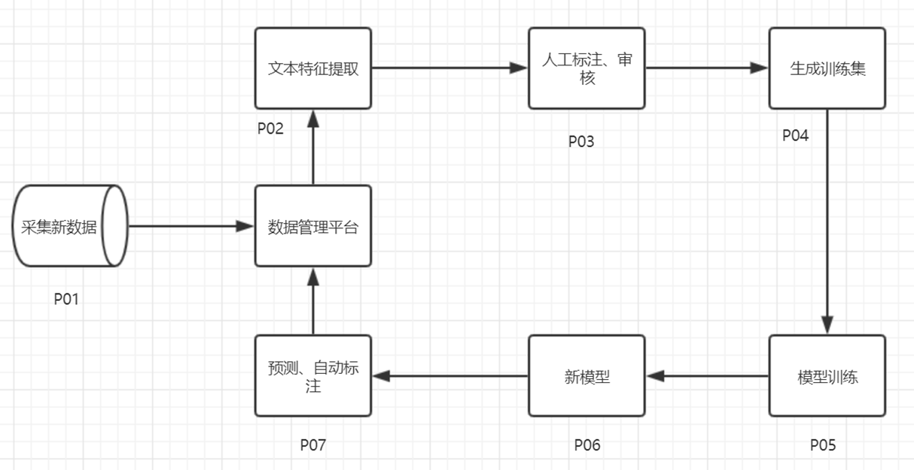

# 一种自动标注、训练、预测海量数据的处理方法

## 1、技术概要

本文所描述的方法主要解决互联网海量数据在进行机器学习时前期投入人工较多，见效成果慢的问题。

在基于大规格数据进行机器学习时，需要投入大量的人工进行数据标注，然后进行模型训练，这种方法耗时较长，模型更新周期长。本文所描述的方法是在人工标注与模型训练采集交替增长，模型更新周期短，见效快。

## 2、技术背景

本文内容主要在解决大规模机器学习过程中，需要前期进行投入数据标注工作量较大的问题，先进行少量的数据标注，然后续过程中利用机器学习的特性进行辅助监督学习，进行纠偏机器学习标注的结果，再反馈到下一轮的学习过程中。重复这个过程不断地加强机器学习的准确率。

## ３、技术方案

本文所描述的方法实现步骤为：

1. 采集数据；
2. 模型训练；
3. 人工纠偏;
4. 持续集成;

流程图如下：

### 1、采集数据

1） 使用Python技术框架scrapyd编写爬虫，设定采集关键词，指定关键词之间的组合关系，在新闻、贴吧、论坛等网站抓取符合关键词的数据，将新闻标题、正文、回复等数据进行结构化保存。

2） 在采集的数据中做文本特征提取，进行自动分类，将数据进行特征打标。

3） 在数据管理工具中浏览数据，结合特征标签，进行标注。

### 2、模型训练

1）数据标注完成后，数据管理工具自动将该数据推送到模型训练平台，训练平台自动将数据按照以竖线分隔的文本进行处理，生成训练集。

2）训练平台在数据量达到预计的阀值时自动触发模型训练。

用一组数据乘以表示的权重随机数，生成随机的结果，根据这个结果与标注的结果进行比较，用梯度下降的方法让生成的结果与标注的结果无限接近，反复重复此过程，直到取得理想的结果为止。

### 3、更新预测模型

1)  在训练时根据预设的比例将训练集的数据分出一部分数据，用于模型的验证，计算出模型的正确率、召回率。

2)  将本计算的正确率、召回率与以前迭代生成的模型进行对比，取测试结果高者更新到预测平台。

### 4、迭代更新

不断采集的数据进入预测平台，对新数据进行预测标注、标注，然后在数据管理工具中进行人工审核，对自动标注的结果进行验证统计，回馈到训练过程。

人工审核验证后的数据重复执行第2步至第4步，达到半监督的自动机器学习。

图中数据管理平台是本方法中使用的一种数据管理工具。

此方法可以在初期只有少量基础训练集的情况下，通过不断采集、识别新数据，根据识别结果进行自动标注，将标注结果纳入新的训练集中进行下一轮训练。不断地重复此方法进行机器学习，可以减少人工标注数据的成本，提高数据识别的准确率。
