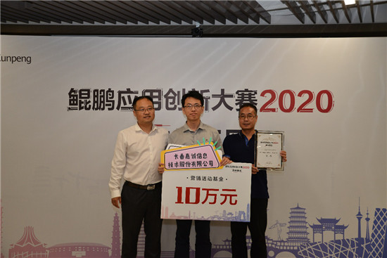

# 获得华为鲲鹏大赛2020吉林省比赛一等奖

8月21日，“鲲鹏应用创新大赛2020”赛事活动在长春举办，吸引了全省众多知名企业、创业创新团队报名参与，围绕基于华为鲲鹏生态的应用体系，“以创新竞技，用代码过招”。

经过激烈角逐，长春嘉诚信息技术股份有限公司的检察公益诉讼产品获得一等奖，长春吉大正元信息安全技术有限公司的OA系统获得二等奖，长春市博鸿科技服务有限责任公司的事件管理系统获得三等奖。本次大赛吉林赛区赛事激励资金总额为33万元，优胜队伍将被推选参加奖金池总额达500万的“华为开发者大赛·鲲鹏应用创新大赛2020”全国赛。

来自嘉诚公司的检察公益诉讼产品获得评委组的高度评价，参赛领队张少卓是检察公益领域开发资深从业者，他表示：“这次非常高兴能够获得评委的青睐，也表明了我们项目在鲲鹏生态下大有可为。鲲鹏提供了开放的硬件、开源的软件平台，各行各业的应用也在加速落地。这为我们开发者提供了非常好的创新与突破契机。我们也会继续推动技术开放创新，尽早让项目投入行业应用，利用鲲鹏生态实现创新部署。”

---

媒体报道：[以创新竞技，用代码过招！鲲鹏应用创新大赛2020吉林开赛-中国吉林网](https://news.cnjiwang.com/jwyc/202008/3205662.html)