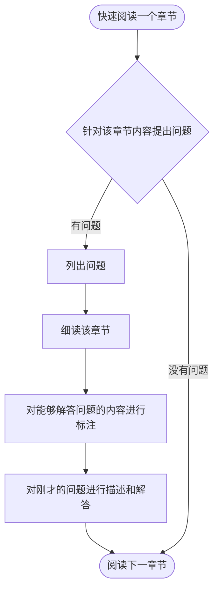

# 我如何撰写读书笔记

这里简单写一下我的读书笔记的记录方法。

## 休闲读物

比如历史、科幻小说后，我会针对一部作品写一个最重要的感想，作为书评和读书总结。

## 工作所需的书籍

1. 快速阅读一个章节
2. 想想该章节是否有价值
3. 把重要的内容标注出来，做文献笔记
4. 思考是否有问题，如果有问题，将问题记录下来，再读一遍章节，然后写下对问题的描述和回答。

```mermaid
graph TD

A([快速阅读一个章节])-->B{针对该章节内容提出问题}

B-->|有问题|列出问题-->细读该章节-->对能够解答问题的内容进行标注-->对刚才的问题进行描述和解答-->C([阅读下一章节])

B-->|没有问题|C
```
