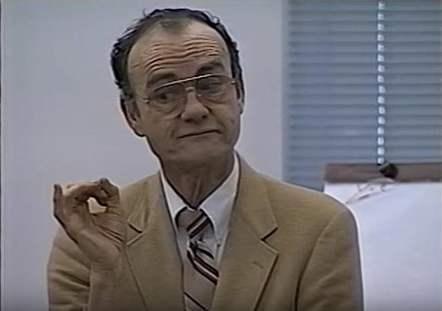

# 瀑布开发模式就是一种原始的直觉

瀑布模型于1970年在 Winston Royce 的论文《管理大型软件系统开发》（Managing the Development of Larger Software Systems）中被提出，将软件生命周期的各项活动规定为按固定顺序而连接的若干阶段工作，形如瀑布流水，最终得到软件产品。自诞生之日起至80年代初期，瀑布模型都是唯一被广泛采用的软件开发模型。

[41765.41801 (acm.org)](https://dl.acm.org/doi/pdf/10.5555/41765.41801)

1901年10月24日，63岁的美国女教师 Annie Edson Taylor 把自己装进了一个木桶，在里面塞满海绵垫，从公山羊以南的美国河岸出发，顺着水流冲下了加拿大一侧的马蹄瀑布。

经过不到20分钟的惊险旅程，勇敢的 Annie 除了脑门被划开了个小口子，大体上安然无恙，她表示“就算拿个大炮顶着我我也不要再来一次！”

原本她尝试这危险的举动，是为了给自己赚到足够的养老钱——她的丈夫早逝，膝下也无儿女。但这次壮举并没有给她带来想象中的声名财富。在短暂依靠出书、签售得到了一点钱之后，她的书商把创造壮举的木桶据为己有，Annie 把大部分所得的钱都花在了雇私家侦探追踪书商上，晚年只得靠为游客摆 pose 和算命度过，最终潦倒而死。

虽然 Annie 没有从她征服尼亚加拉的创举中得到什么，却开创了尼亚加拉勇敢者挑战（Daredevils of Niagara Falls）的先河，后来者此起彼伏……

1911年7月25日，英国马戏团特技演员 Bobby Leach 乘坐特制铁桶，再次尝试 Annie 阿姨当年的创举，成了第二个挑战成功的人。磕坏了膝盖和下巴，花了足足半年才康复。

1920年7月11日，另一位英国人 Charles G. Stephens 也尝试挑战尼亚加拉，选择在自己的桶里加入了一块砧板增加重量，安全起见把自己绑在了砧板上，结果桶打开的时候桶里只剩下了他的一条胳膊。

一百年过去了，竟然还有人在软件行业提倡这样的把戏。
