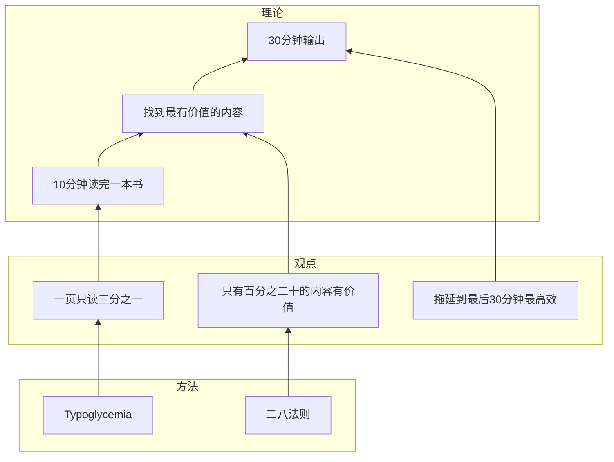

# 为输出而阅读还是为了阅读而输出？

非常典型的日本人的书。全书介绍了25个让你多读书的诀窍，多数都是陈词滥调。

但这样一本书，有一个我非常喜欢的观点，那就是，读书，一定要享受阅读的快乐。就算是致用类图书，也要找到阅读的快乐。

所谓输出式阅读，其实是为了让你更好的享受阅读的快乐。输出不是目的，而是手段。

置于如何输出，这本书基本没有介绍。不如看另外两本书《这样读书就够了》和《卡片笔记写作法》。前者介绍了RIA方法，通过三张贴纸帮助读者深入思考书中的内容和应该如何运用。后者则介绍了德国多产的社会学家卢曼的写作方法，通过卡片记笔记，再通过对笔记进行整理的方式提高写作效率。

这本书倒是介绍了一个挺实用的致用类书籍阅读方法，简单而言，就是每页只读三分之一，用10分钟快速读一遍，找到这本书最值得阅读的内容，再花30分钟仔细阅读并写出感想。

鉴于作者是个写书评的人，我认为他还有个诀窍没有写出来，就是用拖延到交稿前30分钟再看书。

