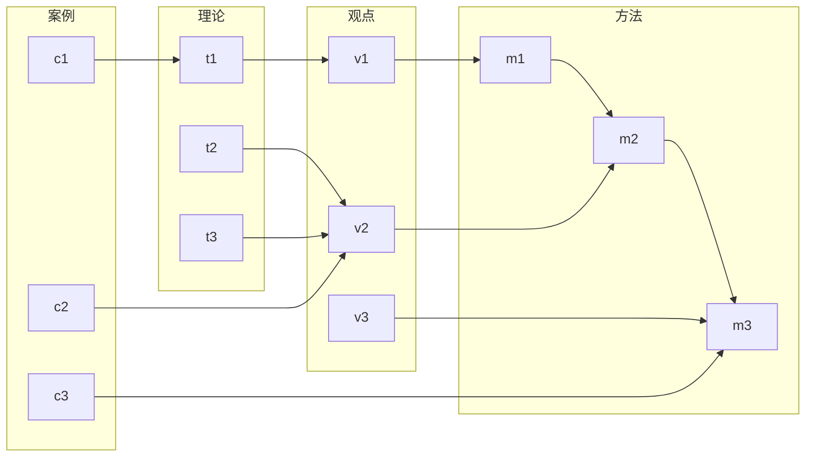
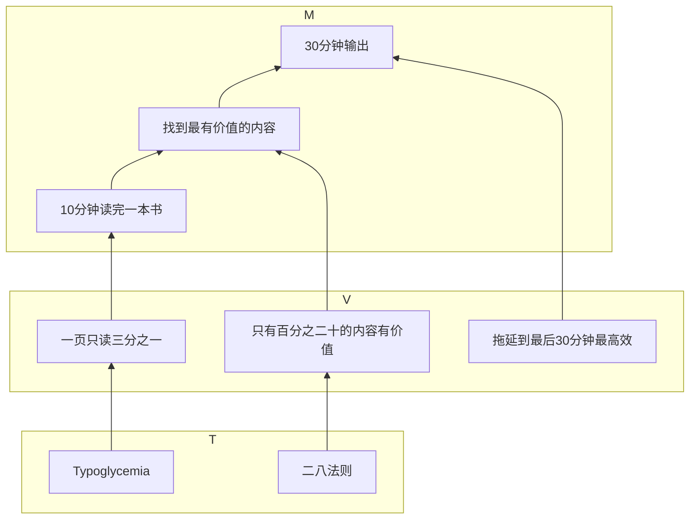

# TPM 画布读书法

一种替代思维导图的读书大纲笔记工具。

这个方法将一本书的理论（Theory）、观点（Point）、方法（Method）提炼成一张泳道图，帮助用户快速理解书的内容。

## 是什么

TPM 画布读书法是我发明的一种阅读笔记方法，目标是快速的总结一本书最核心的观点和方法。

不对一本书进行面面俱到的解读。只对最感兴趣的观点进行深度剖析。《卡片笔记写作法》的一个观点：

> 我认为只要记住几个基本原则，并了解文档系统背后的逻辑，任何人都可以复制卢曼的方法，从而取得学习、写作和研究上的成功。

学习一个方法或技巧，有两个重点，
1. 遵循基本的原则（方法、步骤、技巧）
2. 了解背后的逻辑

背后的逻辑，又可以拆分成两个层面
1. 观点阐述
2. 理论支撑

这样一来，我就拓展出一个学习作者观点的技巧：

1. 了解作者介绍的方法
2. 了解作者支撑这个方法的核心观点
3. 了解作者支撑这些观点的理论

可以通过一个简单的泳道图来画出一个观点：

这种方法也可以称为观点画布。

一本书一般会介绍多个方法，但最核心的不会超过三个。

读完一本书，只要用观点画布捋一下，一本书的精华就掌握的差不多了。

这样一个图，也要比思维导图更容易记忆和回顾。

这个方法也可以称为：TVM：Theory-Viewpoint-Method。

可以用maimerd绘制：

## 比思维导图好在哪

思维导图容易陷入面面俱到的误区。对每个知识点都要描绘，容易失去主线。

观点画布则针对作者的某个特定的观点进行剖析，让阅读更有重点，也让需要快速阅读和学以致用的人更有收获。

## 自下而上

泳道图也可以是水平方向的，这样就能展现自下而上的支撑方式。

比如输出式阅读的观点画布：

## 扩展

两边还可以扩展，比如在T下面，可以扩展为理论资源。每个理论都有一本书甚至多本书对其进行论述，要想更深入的获得相关知识，就要进行主题阅读。

在M的上面，也可以扩展出一层，就是示例。一般书中会循序渐进的抛出观点和方法，并在讲解某个方法的阶段，举出一些例子。一些例子让人更容易理解方法的实施，也容易让人记住作者的观点。

## 读文学类的作品能不能用上？

我们将致用类图书的观点可以划分为理论、观点、方法三层，一本小说也可以划分为人、事、表达观点三层。谁经历了什么，作者用这段情节说明了啥。

其中，表达观点层面，是小说读者，也就是观点画布的绘制者的观点。

致用类图书，我们要学习作者的观点，而文学类作品，我们读完了作者讲述的故事，要发表自己的观点。

总之，观点画布，重点是要描绘观点的。致用类图书中的方法，是作者观点的反映，而小说中的情节，是我们观点的源泉。
