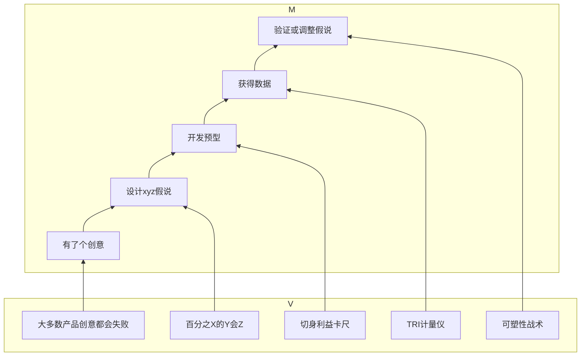

# 做对产品

这是一本针对产品创意前期进行市场预测的小书。所谓做对产品，强调的是要做一个对的产品，即在真正做之前，对创意进行科学评估，避免方向错误导致的失败。

作者提出了一个比较明确的测试方法，并提出了一系列理论予以支撑。

## 观点画布

## 核心内容

1. 先要有一个创意，比如我们要开一家专门教人们写读书笔记的网络培训。
2. 设计一个假说，用来预测市场的反向。比如我们认为，10%的豆瓣用户愿意花100元钱学习跟你读10本书，并学习撰写笔记。
3. 根据假说开发个预型。比如在豆瓣放出一条消息，请大家报名参加一个笔记小组，但前提条件是必须先交学费。进来后你其实没有任何可以交付的产品，但你可以给人家退款，并提供一篇相关内容的原创文章。
4. 立刻行动，收集数据。
5. 根据收集上来的数据，判断这个创意是否可行，如果没有达到xyz的数据预期，是否可以调整和改进。
6. 放弃或改进或开始投入更多的力量来实现创意。

## 总结

该书所提倡的方法，是典型的研究方法。无论是科学研究，还是市场研究，都要基于一个假设，设计实验，收集数据，证实或证伪该假设。

我在2016年搞过类似的实验。当时和一家电商数据交换平台合作，对广告效果进行评估。其实就是在正式的电商广告中，夹杂一些精准投放的调研。当用户被商品广告吸引点击后，看到的是一个问卷。如果我们用的不是问卷，而是一个订单页面，用于判断用户是否真的要进行付费，那么就是一个预型平台了。 
