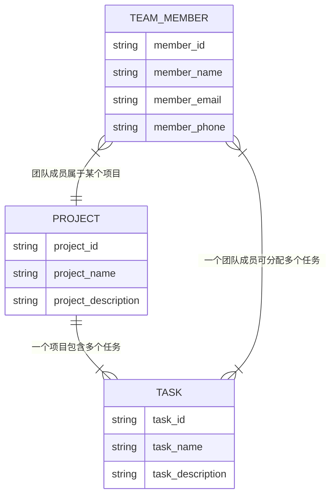
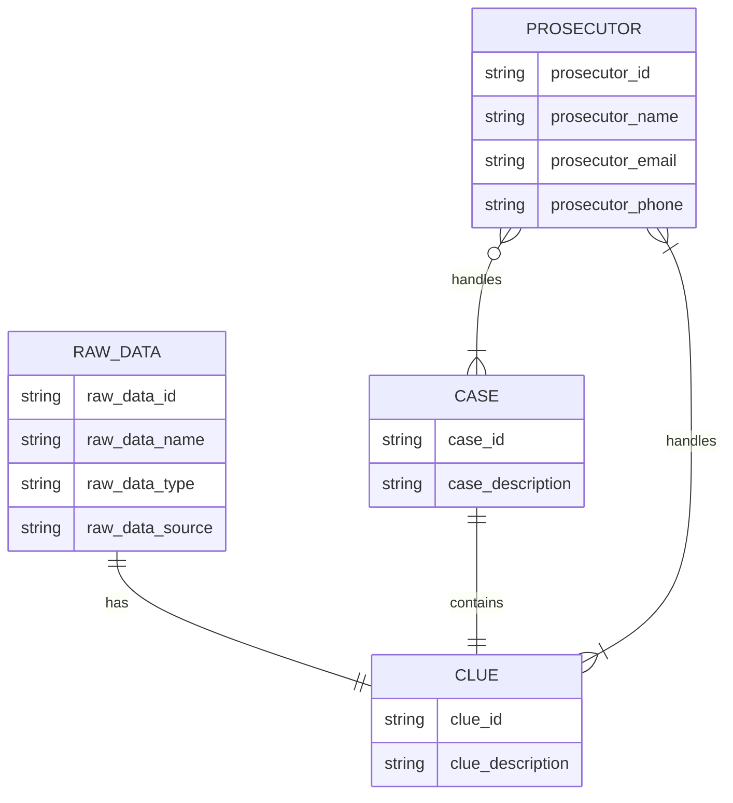
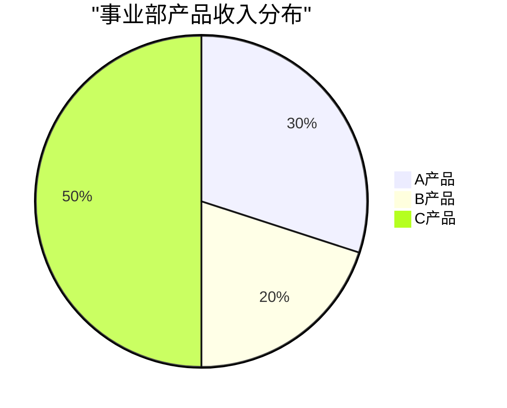

# 用 chatgpt 辅助绘制 mermaid 图形的几个例子

> [!NOTE] prompt
请使用 mermaid 语言写一个实体关系图，包括团队成员、项目、任务三个实体，其中团队成员属于项目，项目包含多个任务，一个任务关联多个团队成员。

> [!NOTE] prompt
请使用 mermaid 语言写一个实体关系图，包括检察官、原始数据、办案线索、案件四个实体，其中原始数据和办案线索一对一关联，办案线索属于多个检察官，案件和办案线索一对一关联，案件属于一个检察官。

> [!NOTE] prompt
用 mermaid 画一个饼图，名为“事业部产品收入分布”，其中 A 产品占30%，B 产品占20%，C 产品占50%

