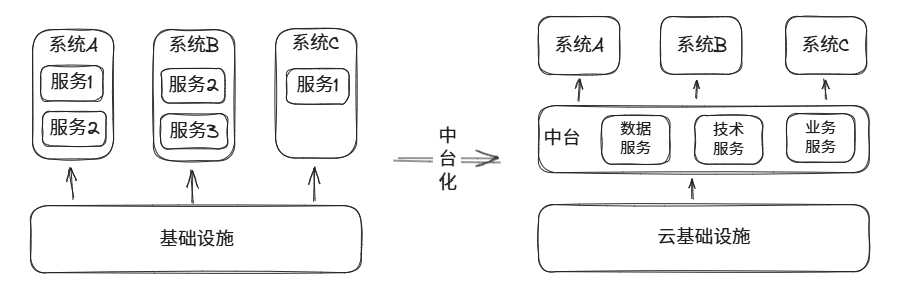
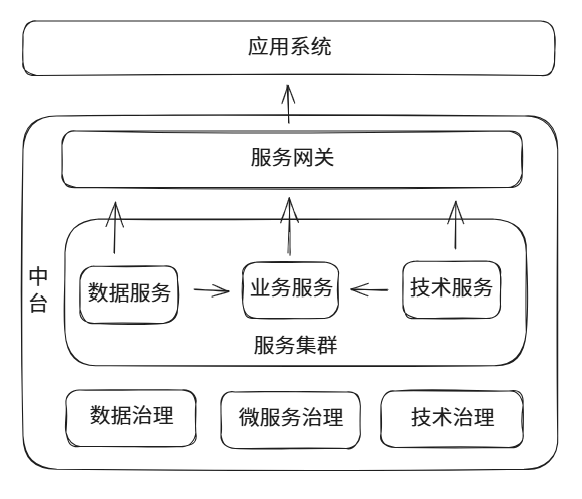

# 到底什么是中台

在数字化系统建设层面，中台是标准化的服务治理平台，包括技术中台、业务中台、数据中台，分别提供对技术、业务、数据服务的治理能力。中台内的服务都通过 API 对外提供，而中台则提供了这些 API 服务（通常基于微服务技术）的生产、消费、安全、性能、观测及生命周期等治理能力。

## 为什么要建设中台

传统信息化建设，一般分为基础设施和业务系统两部分。基础设施包括网络、硬件、云、操作系统、数据库、中间件等，业务系统包括用户直接使用的各种软件服务或应用。

基于中台的数字化建设，将业务系统中共性和标准化、体系化的工作，尤其是针对数据服务、技术服务、业务服务的治理工作集中建设，以平台的形式呈现，以便解决数据烟囱林立、技术标准不统一、系统重复建设等问题。

## 为什么要分三个中台

本质上，中台提供的是服务治理能力，无论什么服务，需要的治理能力是统一的。比如所有的服务都需要服务发现、注册、网关、安全、日志、监控等治理能力。

但是，根据实际的数字化项目开展过程产生的痛点，我们发现数据、技术、业务分别对应三类通用的问题，可以分别解决。那么在统一的服务治理基础上，就有必要分别为数据、技术、业务建设各自的能力平台。

比如数据中台，要提供数据本身的治理能力，例如数据的建模、元数据、数据链路、数据处理、数据生命周期等等。本质上数据治理不属于服务治理的范畴，但通常我们将数据治理的内容纳入到数据中台，便于归纳和理解。

技术和业务服务之间的差异是从使用场景角度进行区分的。一般而言，技术服务是基础服务，可以将其它服务所需的共性需求抽向出来，实现沉淀、复用，比如缓存服务、全文检索、人工智能服务等等。业务服务只提供给应用系统使用，是以解决应用系统中共性的客户需求而开发的服务，比如订单服务、数据查询服务等。一般而言，业务服务要接入用户访问权限控制，而技术服务和数据服务需要应用访问权限控制，因此也可以将统一的 4A 纳入到安全治理范畴中。

