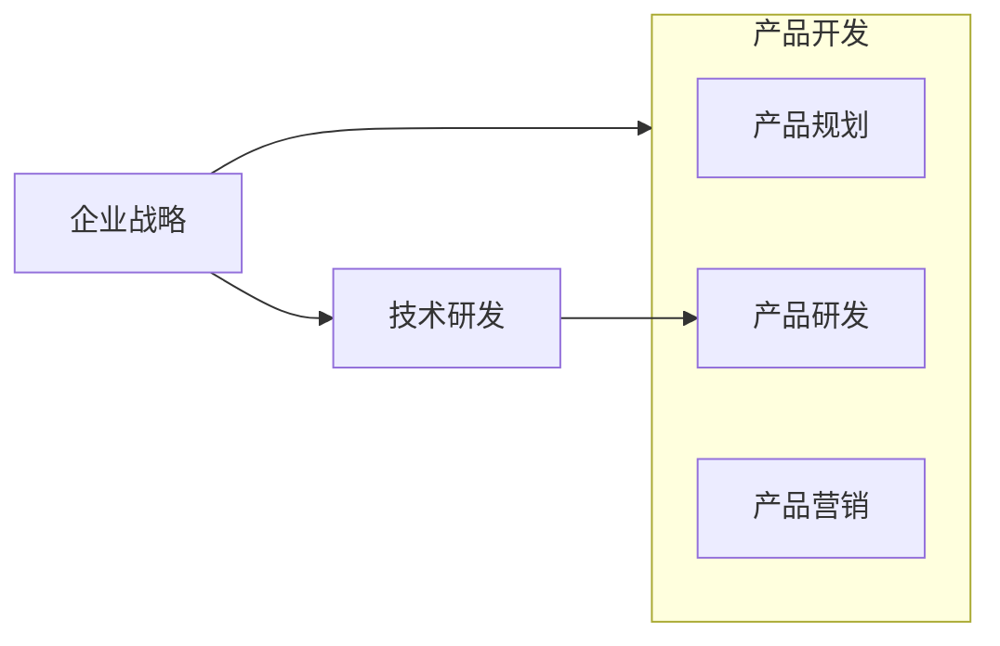

# 产品开发、产品研发和技术研发之间的关系

产品开发，是最宏观、笼统的概念，是指产品的全生命周期过程，从市场和需求的研究出发，到产品的设计和研发，最终实现产品上市销售和改进迭代，直到产品下线的整个过程。

产品研发，是产品开发中从设计到上市之间的一段。狭义特指利用现有技术实现产品设计的过程。

技术研发，是对产品研发所需技术的实现过程。如果产品研发过程所需要的技术已经掌握，或者可以采购，则不需要进行技术研发。但如果产品所需要的技术目前还不存在，就需要进行技术研发。技术研发可以先于产品研发，也可以在产品研发过程中进行。一般而言，技术研发需要先于产品研发进行积累，为产品研发提供保障。

一个科技企业，在明确市场战略的同时，就应该进行技术投入，丰富技术货架。

