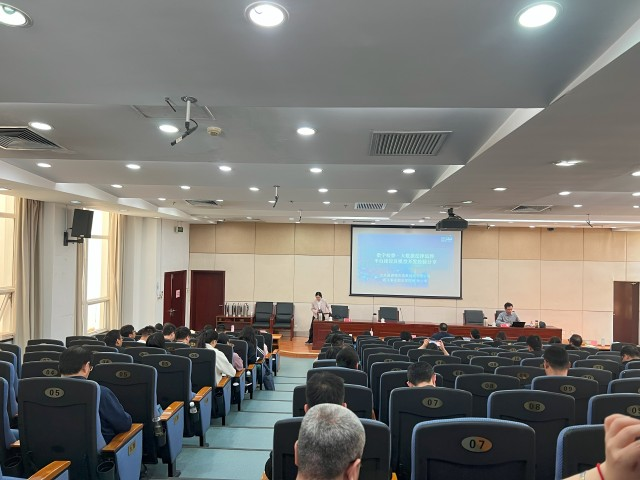
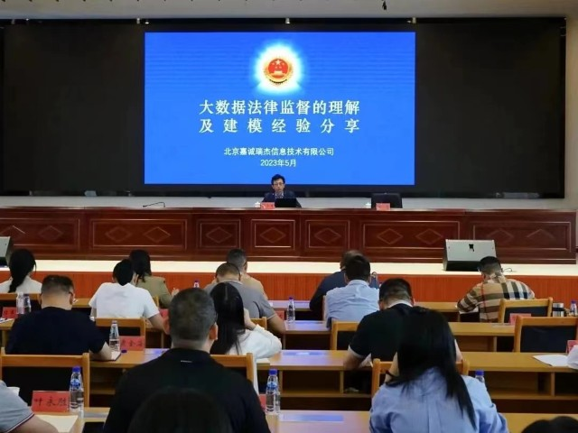
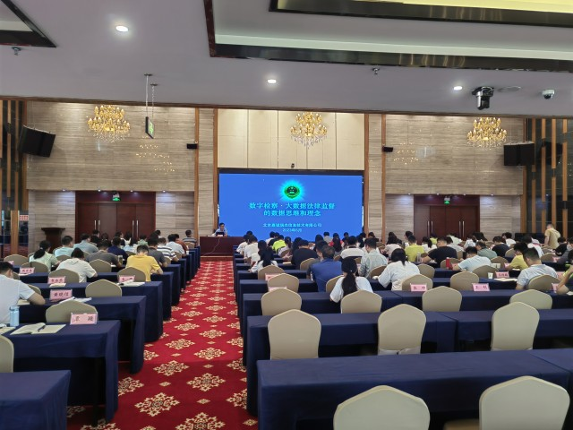
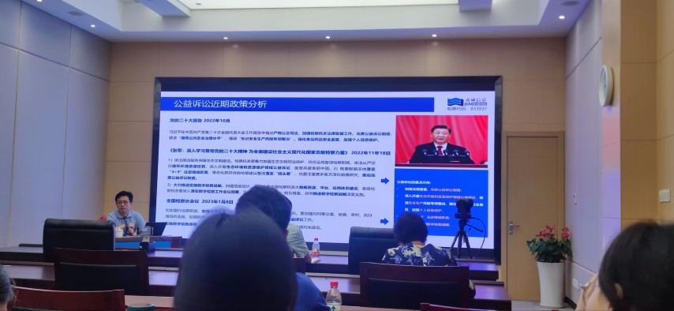

# 23年的一些培训

## 国家检察官学院：数字检察和大数据法律监督理念及落地

2023 年 4 月 26 日，受国家检察官学院邀请，为检察官学院"大数据法律监督常用工具及软件"培训班授课，授课内容为"数字检察大数据法律监督平台建设及模型开发"。

## 福建省检察院：大数据法律监督的理解及建模经验分享

2023 年 5 月 8 日至 11 日，受邀福建省检察院在国家检察官学院福建分院“全省检察机关公益诉讼和生态检察工作培训班”培训，题目为《大数据法律监督的理解及建模经验分享》。

## 广西检察院：数字检察大数据法律监督的数据思维和理念

2023年5月29日，受邀在国家检察官学院广西分院培训《数字检察大数据法律监督的数据思维和理念》。

## 宁波市检：大数据法律监督模型开发技术及数字赋能公益诉讼案例分享

2023年6月28日，受宁波市检察院邀请培训《大数据法律监督模型开发技术及数字赋能公益诉讼案例分享》。

