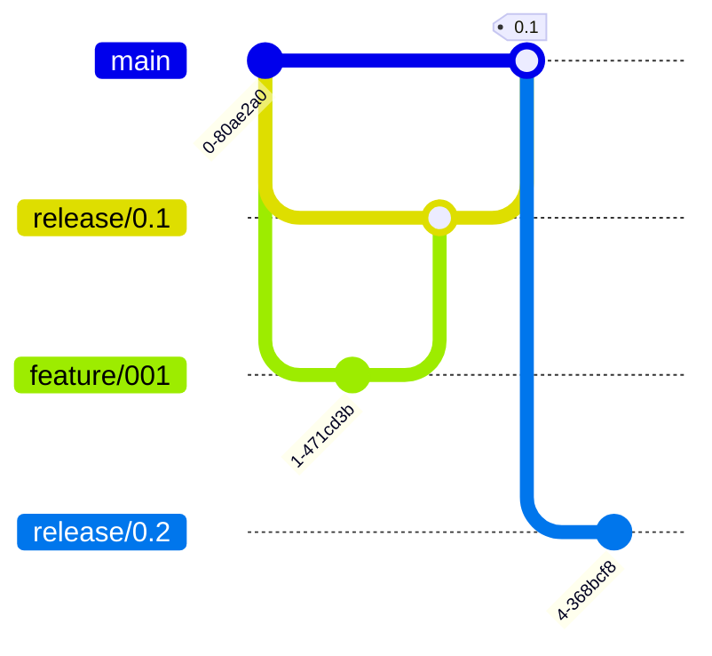

---
aliases:
  - 常见 Git flow 描述
title: 常见 Git flow 描述
datetime: '2023-08-22 07:54'
permalink: /posts/202308220754
tags:
  - git
  - 研发
prev:
  text: 产品测试一定要找切身利益者做被试样本
  link: /posts/202308312136
next:
  text: 到底什么是软件配置管理？
  link: /posts/202308181444
---
# 常见 Git flow 描述

## github flow

**描述**
- 长期分支：main，生产环境分支。
- 特性分支：
	- 要做任何开发只要拉取一个特性分支开发即可。
	- 每个特性分支都要完成合并请求、代码评审，部署测试等工作。当测试成功后，合并到 main 分支。

**特点**
- 优点：简单，适合开源项目
- 缺点：需要团队更加紧密的协作

## Git flow

**长期分支**
- Main：主分支，持续在生产环境构建。
- Develop：开发分支，持续在开发环境构建。

**周期分支**
- Hotfix：当生产环境发现缺陷，通过从 main 分支拉取 hotfix 修复，并将 hotfix 合并到 main 和 develop 分支。
- Feature：特性分支。当要开发一个特性时，从 develop 分支拉取。开发完成后，合并回 develop 分支。
- Release：发布分支。当启动一个版本计划，从 develop 分支拉取。当该计划所有 feature 开发完成后，将 release 分支合并到 main 和 develop 分支。持续在测试环境构建。

### Git flow：feature

### Git flow：hotfix

## Aone flow

**长期分支**
- Main：主分支，持续在生产环境构建。

**周期分支**
- Feature：特性分支。当要开发一个特性时，从 main 分支拉取。开发完成后，合并到指定的 release 分支。
- Release：发布分支。当启动一个版本计划，从 main 拉取分支。当该计划所有 feature 开发完成后，将 release 分支合并到 main 分支。当同时启动多个版本计划时，可拉取多个 release 分支。持续在测试环境构建。

