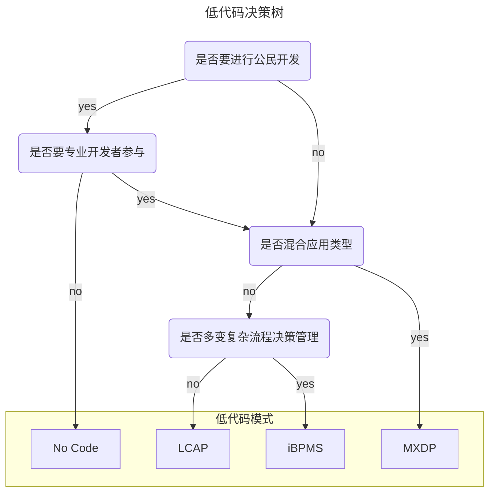

# 低代码类型和决策树

选自 Gartner 2019 年发布的低代码决策树。

## 概念

Gartner 认为，低代码主要有以下几个主流分支：  

### 1) 无代码开发平台 （No Code）

无代码开发平台属于低代码平台的一种，不提供或者仅支持非常有限的编程扩展能力，一般仅用来开发内部管理类或市场营销类表单。  

### 2) 低代码应用平台（LCAP）

LCAP 属于狭义的低代码平台，是万金油类产品，可用来开发包含前端和后端的应用。它关注通过声明式的模型驱动和基于元数据的服务来提供快速的应用开发、部署和执行。这个市场囊括了大部分低代码技术供应商，主要产品是具备自描述性的无代码应用开发工具。  

### 3) 多重体验开发平台（MXDP）

MXDP是一套为专业开发人员提供集成式前端开发工具与后端服务，实现可扩展与跨数字接触点的应用程序开发平台。MXDP 提供快速开发跨平台 App 的工具，突出前端开发能力，一般用来开发多平台/多终端应用。这些产品通过提供一套包含前端开发工具和后端服务的集成套件，使开发人员（有时甚至是非开发人员）能够跨各类数字设备进行相应用途和形式的扩展性应用开发。它们支持自定义移动应用、响应式 Web 和渐进式 Web 应用（PWA）、沉浸式用户体验及对话式应用。  

### 4) 智能业务流程管理套件（iBPMS）

整合了 AI 等技术的业务流程管理系统（BPMS）突出后端流程定义和数据整合能力，一般用于解决大型企业的跨系统业务流程。这类模型驱动的（因而是低代码的）开发平台可以在操作模型和应用时动态变化。它们通过流程和业务规则/决策实现业务操作的自动化。

- NoCode：零代码或称无代码，是一种完全不需要任何代码编程的开发方式，它主要围绕企业数据和业务管理需求，通过可视化方式设计数据结构，实现用户交互形式、设置访问权限和定义工作流程的平台。
- LCAP（Low-Code Application Platforms）：它提倡“全民开发者”，不适合任务关键型应用程序，更侧重于简化前端体验的创建（主要针对web和移动设备）。
- MXDP（Multiexperience Development Platform）：多重体验开发平台。MXDP 是一种开发工具，主要用于帮助开发者以更高的效率、更快的速度，开发出跨平台的软件系统。
- iBPMS：智能业务流程管理系统，指附加了人工智能（AI）以及类似云技术的业务流程管理工具。

特征

- Citizen development：公民开发
- Professional developers：专业开发
- 多应用类型
- 复杂的流程、决策、案例管理需求

## 低代码选型决策图

