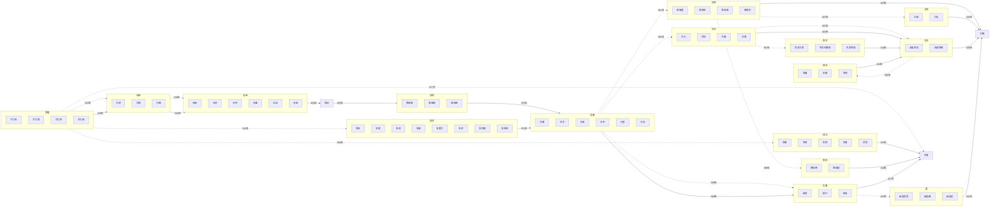

# Prompt：使用Mermaid语法绘制历史图谱

## 提示词

>[!note] 提示词
>使用Mermaid语法绘制一个完整的**两晋十六国图谱**，要求如下：
>1. 政权表示：
>	- 每个政权用`subgraph`标识，政权名称用中文表示。
>	- 每个`subgraph`内包含该政权的**所有领袖**，领袖名称用中文表示。
>2. 关系类型：
>    - **灭亡关系**：用实线箭头`-->|灭亡时间|`表示后面的政权被前面的政权所消灭。。
>    - **衍生关系**：用点划线箭头`-.->|衍生时间|`表示前面的政权衍生了后面的政权（包括后面政权的肇始人曾在前面政权中担任职务，后独立出来建立政权等情况）。
>3. 政权范围：
>    - 包括该时期的**所有政权**。
>4. 具体要求：
>    - 标明政权的关系，包括灭亡和衍生关系。
>    - 确保所有关系逻辑正确，避免循环引用。
>5. 输出格式：
>    - 使用Mermaid语法，确保代码可直接在支持Mermaid的工具中渲染。
>    - 图形的方向是**由左至右**。

# 生成结果

