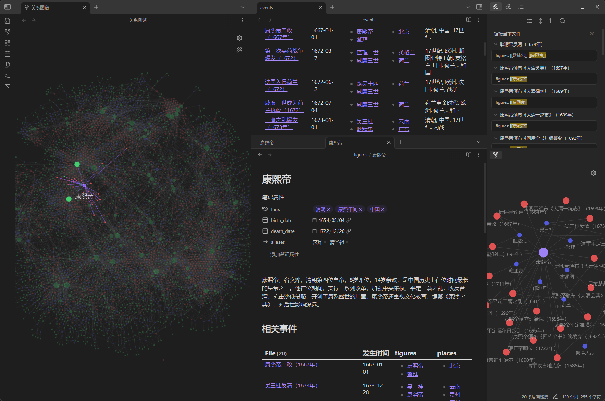

[GitHub - citywill/ObsiGen](https://github.com/citywill/ObsiGen)

---

# ObsiGen：Obsidian历史笔记自动生成Agent

作为一名历史爱好者，你肯定用过Obsidian整理历史事件和人物之间的关系，也体验过大量笔记重复编辑的烦恼。

此时你一定渴望ObsiGen，能利用大模型自动创建指定时期、范围的历史笔记的魔法程序。



## 使用方法

1. 下载脚本

2. 安装环境

    - 安装python环境（推荐3.10+）
    - `pip install -r requirements.txt `

3. 配置参数

    - 将example.env复制为.env文件
    - 修改env文件中的参数（参看文件注释）

4. 运行脚本

    `python ObsiGen.py`

几分钟后，一个拥有几百条笔记的历史仓库就建立好了

## 索引笔记创建方法

可以创建事件（event）、人物（figure）等索引笔记，dataview代码示例如下：

```dataview
table happend, figures, places, tags
from "events" 
sort happend asc
```

## 简单介绍一下原理

1. 要求大模型输出特定历史时期发生的历史事件
2. 循环事件列表，要求大模型输出详细的事件信息，创建事件笔记
3. 遍历事件信息中包含的历史人物，要求大模型输出人物信息，创建人物笔记
4. 仓库中还包括两个索引笔记，分别用dataview列出以时间排序的事件和人物表格

## 注意事项

使用不同模型存在较大差异，慎用低参数量本地大模型，即使Deepseek也会有较多错误和重复
