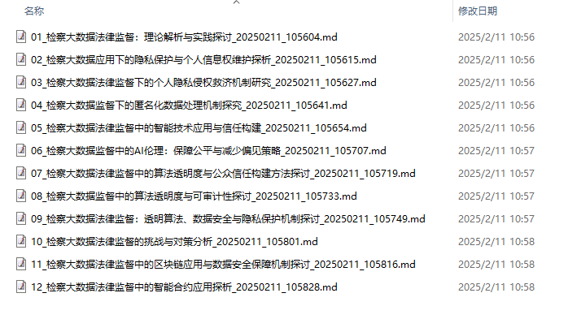
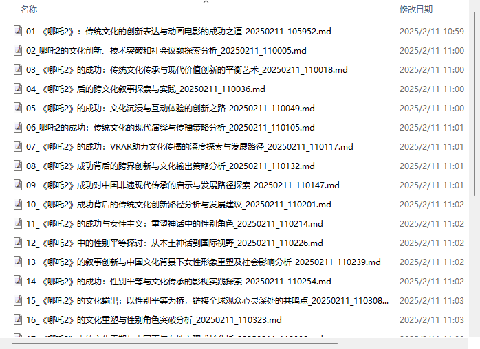
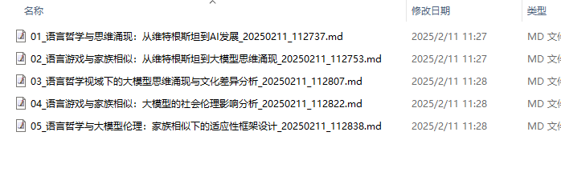

# DeepTopic - 深度主题生成器

DeepTopic 是一个基于大语言模型的深度主题生成工具，它能够帮助您围绕一个初始主题，生成深入的知识内容。

## 功能特点

- 基于大语言模型的深度主题生成
- 支持自定义模型参数
- 自动保存生成的内容到文件
- 支持流式输出，实时查看生成进度
- 可自定义文章结构和章节

## 安装说明

1. 克隆项目到本地：
```bash
git clone [您的仓库地址]
cd deeptopic
```

2. 安装依赖：
```bash
pip install -r requirements.txt
```

## 配置说明

1. 复制`.env.example`文件为`.env`：
```bash
cp .env.example .env
```

2. 在`.env`文件中配置以下参数：
```
BASE_URL=http://your-api-base-url
MODEL_NAME=your-model-name
API_KEY=your-api-key
MAX_ROUNDS=5 # 思考深度（轮次）
TEMPERATURE=0.7 # 思考随机性
ARTICLE_SECTIONS=核心概念解释,深入分析,实际应用,相关延伸 # 文章章节结构
```

## 使用方法

运行程序并指定初始主题：
```bash
python deep_topic.py "您想探讨的主题"
```

生成的内容将保存在`output`目录下对应的主题文件夹中。

## 目录结构

```
deeptopic/
├── deep_topic.py    # 主程序
├── .env            # 配置文件
├── output/         # 输出目录
└── README.md       # 说明文档
```

## 注意事项

- 确保已正确配置`.env`文件中的API参数
- 生成的内容将自动保存在`output`目录下
- 可以通过修改`ARTICLE_SECTIONS`配置来自定义文章的章节结构

## 附录：输出效果

### 检察大数据法律监督



### 哪吒2的成功



### 维特根斯坦的语言哲学和大模型的思维涌现




### 输出文章样例

---

**检察大数据法律监督中的智能合约应用探析**

利用智能合约在检察大数据法律监督系统中自动执行法规和内部政策

**一、核心概念解释**

智能合约是一种基于区块链技术的自动化协议，它能够在满足预定条件时自动执行条款。这种技术能够帮助实现数据的安全存储与流转，并确保所有的交易都遵循预设规则。在检察工作中利用智能合约可以加强监管力度，促进公正审判和廉洁执法。

**二、深入分析**

1. 合规性：通过编写符合法律法规及政策规定的代码，保障了系统的标准化操作流程，避免人为因素导致的违规行为。
2. 效率提升：自动化的处理过程减少了繁琐的人工审核环节，使案件管理更加高效快捷。同时，由于规则被编码进软件中去执行，因此可以大大降低因信息不对称而导致的效率损失。
3. 数据安全与隐私保护：智能合约使用区块链技术进行数据存储，具有高安全性且难以篡改的特点；并且能够对敏感信息实施严格的权限控制措施。

**三、实际应用**

1. 案件录入审核
   - 使用智能合约创建一个自动化案件筛选器，当提交新案件时，该程序将自动验证其是否符合所有必需的法律标准和内部流程要求。
2. 证据链管理
   - 设计一种能够记录并跟踪关键文件与数据变动版本号、时间戳等细节信息的方法。通过引入智能合约机制，可以确保整个过程不可篡改且公开透明，有利于维护司法公信力。
3. 决策支持系统
   - 开发一个基于大量历史案例分析的辅助决策平台，其中嵌入了法律条文理解和适用算法以及机器学习模型，从而为一线检察官提供更加准确有效的参考依据。

**四、相关延伸**

随着物联网技术的发展和普及，未来可以进一步拓展智能合约的应用范围。例如，在涉及多个政府部门联合执法的情境下，可以通过建立跨机构的数据共享平台实现更广泛意义上的协同合作；同时也可以探索与5G通信网络相结合的可能性，以期达到更快捷的信息传递效果。

综上所述，将智能合约技术应用于检察大数据法律监督系统中具有重要的现实意义和广阔的应用前景。它不仅有助于提升工作效率、保障信息安全，还能有效促进司法公正透明度的提高。
