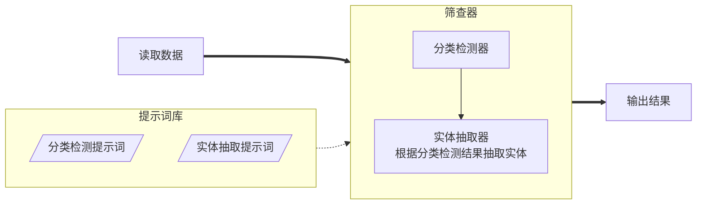

# 智能线索筛查系统

## 介绍

智能线索筛查系统是一套基于大模型的线索检测和关键实体识别系统，用于辅助办案人员判断文本内容是否符合线索筛查要求。

## 功能特性

- 线索筛查：根据规则库对线索进行分类和检测，并返回筛查结果。
- 分类检测器：根据规则库中的分类规则，对输入文本进行分类。
- 实体抽取器：根据规则库中的检测规则，对输入文本进行线索判定是否符合筛查要求。
- 筛查提示词：每个监督点包含分类提示词和检测提示词，分别用于分类检测和实体抽取。
- 提示词设计器：辅助用户通过对话方式设计筛查提示词（包括分类检测和实体抽取提示词）。

## 解决痛点

1. 传统分类筛查和实体抽取成本高，性价比低
	- 我们采用大模型进行线索的筛查和针对监督要点的实体抽取，实现成本、效率和准确性的平衡
	- 使用单张3060显卡（12G），实现每秒0.5条数据的筛查和实体抽取，准确率达到95%以上。
2. 大模型提示词难写，需要反复实验
	- 我们设计了提示词生成器，可以根据原始材料生成专业的提示词，用于进行分类检测和实体抽取。

## 界面截图

### 线索筛查器


### 筛查提示词设计器


## 系统设计

### 技术路线

- 采用`openai`模块连接大模型
- 采用`fastapi`开发restful接口
- 采用`streamlit`开发界面程序
- 使用`ollama`加载`qwen2.5:14b`验证

### 用户使用流程


### 线索筛查流程



### 提示词设计器

用户输入线索筛查描述，提示词设计器生成分类提示词和检测提示词。

用户描述示例：

```prompt
分类依据：
根据《北京市人民检察院打击整治销假销劣大数据法律监督模型办案指引（试行）》，可能涉及销假销劣领域的七类投诉数据，按照属地管辖向各院统一下发，投诉数据主要包括：商品服务质量；假冒伪劣；网络交易、电视购物、网上商城等销售存在质量问题的产品；假冒商品；展会举办方不履行知识产权保护职责等情形，在这些投诉中可能涉及退费纠纷、虚假宣传等问题。

提取相关要素：
（1）属地：应当逐项填录，不能合并填录，以便明确各院有效投诉数量，如海淀区。
（2）热线号：应当完整摘录，明确投诉时间。
（3）所涉市场、商场或平台：应当填录与被投诉点位有关的市场、商场或平台。市场、商场需要填写全称并标注地址，方便日后进行可视化展示；平台尽量以简短字段表述。如不涉及上述内容，此项目可空。
（4）被投诉人：若被投诉人是自然人，需填写姓名；若被投诉人是公司，需填写公司名称及法定代表人姓名。  
（5）被投诉地点：需填写详细地址，以地图可查询到的地址为准。  
（6）涉诉商品种类：目前进入统计项目的类别包括两类：第一类是生活中常见分类，如服装饰品、生活用品、食品、电子产品、工业用品、其他等；第二类是刑事案件中涉及的高发物品，如白酒、桶装水、汽配、口罩、化妆品、烟、茶、保健品、药品、建材、冬奥特许产品、儿童食品、儿童玩具、收藏品、医疗器械、书籍、软件、种子、农药、兽药、化肥等。  
（7）涉诉商品品牌：应填写全称，以商标局公示的商标信息为准，若不涉及品牌，此项目可空。  
（8）涉诉投诉金额：以万元为单位，有总金额的填写总金额，以 5 万元为限，具体填录为大于 5 万元、小于 5 万元。没有总金额的，填写单价金额。没有总金额和单价金额的，此项目可为空。
（9）处理结果：从源数据 handle_resu 中确定投诉具体处理结果，具体包括以下八种情形：行政处罚；移送刑事立案；因取证不能而未处理；因管辖不能而未处理；因和解而未处理；因投诉人寻求司法诉讼而未处理；仍在处理中；其他。  
（10）满意度：具体包括三种情形，满意；不满意；未记录。  
（11）前科或涉诉情况：被投诉主体可查询到的民事侵权情况；行政处罚情况；刑事判决情况。  
（12）投诉人信息：重点关注身份，如 60 周岁以上的老年人、未成年人、残疾人等可能涉及支持起诉对象。  
（13）其他：如果本区投诉数据反应出其他重大问题，可以自行填录，如果有必要，可以附相关问题专报。
```

#### 生成分类检测提示词

```prompt
你是一名提示词设计师，用户将提供给你一个分类描述，请依据该要求生成分类命名和分类提示词，以便让大模型能够判断输入文本是否符合该分类。以json格式输出。

描述:
- title：分类名称，中文，不超过10个字
- prompt：分类提示词，能通过该提示词使大语言模型对输入文本进行分类
```

#### 生成实体提取提示词

3. 通用提示词

```prompt
你是一名提示词设计师，请根据用户提供信息设计一个实体提取提示词。

例如：
"""
- region: 属地
- hotline_number: 热线号
- related_market: 所涉市场、商场或平台
- complainant: 投诉人
- complainant_label: 投诉人标签（60岁以上老年、残疾）
- defendant: 被投诉人
- complaint_location: 投诉地点
- involved_product_type: 涉诉商品种类
- involved_product_brand: 涉诉商品品牌
- complaint_amount: 涉诉投诉金额
"""
```

### 返回结果

```json
{
  "data": [
    {
      "classify": "分类名称",
      "reason": "推理过程"
      "entities": {
        "实体名称": "实体值",
        ...
      }
    },
    ...
  ],
}
```
