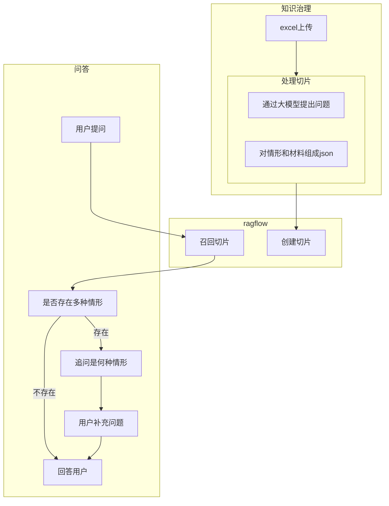

# 基于ragflow开发基于知识库的问答思路

## 问题

- 在ragflow中，复杂的问答需要进行agent编排，但也未必有良好效果
- 比如，一个excel，基于事项、情形、材料，用户要根据事项提问，智能体根据情形进行多轮问答，返回材料。
- 基于ragflow的QA、Table的chunck方法都不理想，要基于复杂编排。

## 解决方案

- 通过ragflow的api创建切片，在切片前，对数据进行如下处理：
	- 通过大模型针对事项提出问题（questions）
	- 把情形和材料处理成json，作为chunck的content
- ragflow会对questions优先想量化
- 用户提问后，召回chunck，会返回情形和材料的json，如果有多个情形，则通过大模型进行追问
- 用户回答后，大模型判断用户提出的情形，并据此给予综合回答。

## 流程

