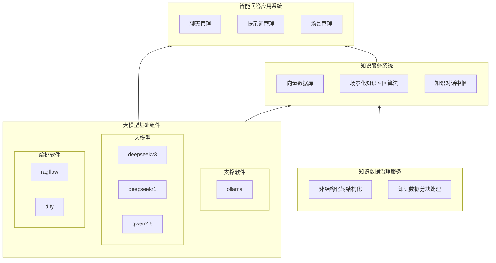

# 基于大模型的知识库问答系统建设方案

在数字化转型加速推进的当下，企业及机构积累的海量知识亟需高效激活与利用，基于大模型的知识库问答系统凭借其强大的语义理解与知识调用能力，成为解决知识管理难题的核心方案。本文将结合系统架构图，从核心架构、模块功能、协同机制及建设价值四个维度，详细阐述系统的建设思路与实现路径。

## 一、系统核心架构：四层联动的整体设计

基于大模型的知识库问答系统采用分层架构设计，通过“大模型基础组件-知识数据治理服务-知识服务系统-智能问答应用系统”四层模块的协同联动，构建起从知识输入到智能问答输出的全链路闭环。各层模块既相互独立承担特定功能，又通过精准的数据流转形成有机整体，确保系统兼具高效性、稳定性与扩展性。

## 二、核心模块功能解析

### （一）大模型基础组件

作为系统的底层支撑核心，大模型基础组件整合了“支撑软件-大模型-编排软件”三大子模块，为整个系统提供算力支撑、模型能力与流程编排能力。支撑软件采用ollama，其轻量化的部署特性与高效的模型调度能力，确保大模型能够快速响应各类计算需求；大模型层引入deepseekv3、deepseekr1、qwen2.5等多款主流大模型，通过多模型协同策略，兼顾语义理解的深度、回答的准确性与场景适应性；编排软件则整合ragflow与dify，实现对问答流程、知识调用路径及模型调用逻辑的可视化编排，大幅降低系统运维与流程优化的门槛。

### （二）知识数据治理服务

知识数据的质量直接决定问答系统的效果，知识数据治理服务承担着从原始数据到标准化知识的转化重任，核心包含“非结构化转结构化”与“知识数据分块处理”两大功能。在数据处理初期，系统通过OCR识别、自然语言处理等技术，将文档、图片、音频等非结构化数据转化为可编辑、可分析的结构化文本，解决传统知识库中“数据孤岛”与“格式混乱”问题；针对结构化后的海量知识，系统采用智能分块算法，结合语义关联性将知识拆解为合理粒度的知识块，既保证知识的完整性，又为后续的精准召回奠定基础。

### （三）知识服务系统

知识服务系统是连接数据治理与应用输出的关键枢纽，通过“向量数据库-场景化知识召回算法-知识对话中枢”的协同运作，实现知识的高效存储、精准召回与智能匹配。向量数据库作为知识的“存储仓库”，将分块后的知识转化为向量嵌入并进行高效存储，支持毫秒级的海量数据检索；场景化知识召回算法则基于用户问答场景的上下文信息，结合语义相似度计算与场景标签匹配，从向量数据库中精准召回与当前问题高度相关的知识片段；知识对话中枢作为核心调度模块，一方面接收来自知识数据治理服务的标准化知识并更新至向量数据库，另一方面根据应用系统的问答请求，协调召回算法与大模型完成知识匹配与回答生成，确保问答内容的准确性与针对性。

### （四）智能问答应用系统

智能问答应用系统是面向用户的直接交互层，通过“聊天管理-提示词管理-场景管理”三大功能，为用户提供便捷、个性化的问答服务体验。聊天管理模块负责处理用户与系统的实时交互，支持多轮对话上下文的记忆与关联，确保对话的连贯性；提示词管理模块通过对提示词模板的标准化管理与优化，提升大模型对用户需求的理解精度，同时支持不同场景下提示词策略的快速切换；场景管理模块则预设企业客服、内部培训、技术支持等多种典型应用场景，用户可根据需求快速切换场景模式，系统将自动匹配对应的知识库与问答策略，实现“场景化精准问答”。

## 三、模块协同机制

系统各模块通过清晰的数据流转路径实现高效协同，形成完整的知识处理与问答闭环。首先，知识数据治理服务对原始知识进行结构化转化与分块处理，生成标准化知识块并输送至知识服务系统，由向量数据库完成存储；其次，大模型基础组件为知识服务系统提供模型能力支撑，助力知识向量转化、语义匹配等核心环节的实现，同时直接为智能问答应用系统提供对话生成的算力支持；再次，知识服务系统接收智能问答应用系统的用户请求后，通过场景化召回算法从向量数据库中提取相关知识，经知识对话中枢整合后传递给大模型，生成针对性回答；最后，智能问答应用系统将回答反馈给用户，同时将交互数据同步至各模块，实现系统的持续优化。

## 四、系统建设价值

基于大模型的知识库问答系统的建设，将为企业及机构带来多维度价值提升。在知识管理层面，实现对海量分散知识的标准化治理与高效存储，打破“知识沉睡”困境；在服务效率层面，通过智能问答替代部分人工咨询，大幅缩短响应时间，提升服务的规模化处理能力；在用户体验层面，场景化问答与多轮对话能力确保用户需求得到精准满足，降低用户获取知识的成本；在企业运营层面，系统沉淀的交互数据可反哺知识更新与业务优化，形成“知识积累-服务优化-业务提升”的良性循环。

综上所述，该系统通过四层架构的协同设计，构建了从知识治理到智能问答的全链路解决方案，不仅解决了传统知识管理与服务中的效率瓶颈问题，更实现了知识价值的深度激活，为数字化时代下的知识服务升级提供了有力支撑。
