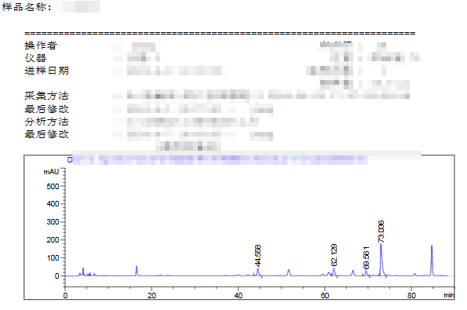
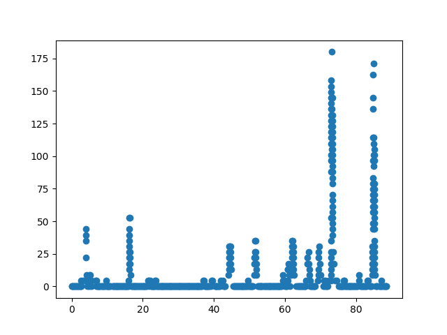

# 液相色谱图数据还原和峰值、面积计算方案

当液相色谱仪只能输出液相色谱图，但无法输出原始数据时，可以使用本技术将液相色谱图还原为原始数据，再计算峰值和面积。

## 技术实现

1. 报告数据识别：读取原始图像，识别报告中的文本，实现数据结构化处理。
2. 液相色谱图区域识别：识别图像中的液相色谱图区域，纠正图形扭曲，使横纵坐标垂直。
3. 坐标轴识别：将识别、截取出来的液相色谱图进行二值化处理，识别图像中的原点位置和极值位置。
4. 散点识别：识别散点像素，去掉噪声点，只保留有效散点。
5. 散点数据还原：计算有效散点像素的位置，还原散点坐标值，保存到csv文件中。
6. 计算峰值和面积：将散点数据按照吸光度（y轴）的值在保留时间（x轴）上进行分组，获得每组数据的吸光度峰值，以及保留时间的启止值，近似计算峰面积。

## 图示

## 计算结果

|组|峰值（时间）|峰值（吸光度）|面积|
|---|---|---|---|
|Group 1|4.006172839506173|43.90243902439024|23.98373983739837|
|Group 2|16.20679012345679|52.68292682926829|9.593495934959309|
|Group 3|44.25|30.731707317073173|11.192411924119197|
|Group 4|51.53395061728395|35.1219512195122|9.593495934959373|
|Group 5|59.3641975308642|8.78048780487805|2.398373983739812|
|Group 6|61.00308641975309|17.5609756097561|4.796747967479624|
|Group 7|61.91358024691358|35.1219512195122|12.791327913279082|
|Group 8|66.64814814814815|26.341463414634145|14.39024390243887|
|Group 9|69.56172839506172|30.731707317073173|11.192411924119197|
|Group 10|73.02160493827161|180.0|196.66666666666586|
|Group 11|84.85802469135803|171.21951219512195|62.35772357723552|
