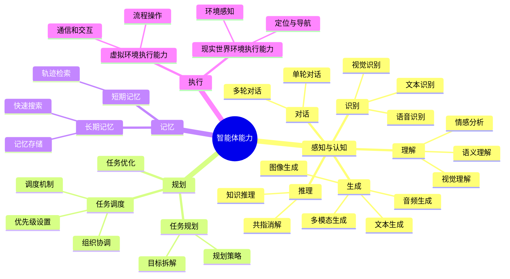

---
aliases:
  - 智能体的能力
created: 2025-05-27T00:00:00.000Z
updated: 2025-05-27T00:00:00.000Z
title: 智能体的能力
datetime: '2025-05-27 13:07'
permalink: /posts/202505271307
description: null
category: 资料摘录
tags:
  - 智能体
  - 人工智能
prev:
  text: 智能体、应用和智能体应用
  link: /posts/202505290856
next:
  text: 液相色谱图数据还原和峰值、面积计算方案
  link: /posts/202505261517
---

# 智能体的能力

- **感知与认知**：包括识别、理解、对话、生成和推理。
- **规划**：包括任务规划、任务调度和任务优化。
- **记忆**：包括短期记忆和长期记忆。
- **行动**：包括虚拟环境执行能力和现实世界环境执行能力。

---

- 资料来源：国际电信联盟（ITU）
- 访问网址：[基于大规模预训练模型的人工智能智能体的要求和评估方法](https://www.itu.int/rec/T-REC-F.748.46-202503-I)
