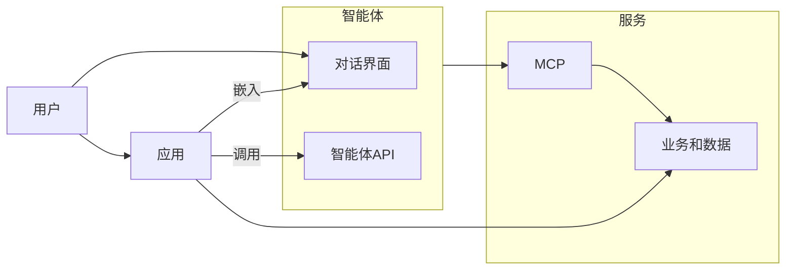

---
aliases:
  - LLM下一体化信息化平台的演变
  - 智能体、应用和智能体应用
created: 2025-05-29T00:00:00.000Z
updated: 2025-05-29T00:00:00.000Z
image: /assets/智能体应用平台架构.svg
title: 智能体、应用和智能体应用
datetime: '2025-05-29 08:56'
permalink: /posts/202505290856
description: null
category: 永久笔记
tags:
  - 平台
  - 架构
next:
  text: 智能体的能力
  link: /posts/202505271307
---

# 智能体、应用和智能体应用

在LLM出现之前，一体化信息化平台，被定义成以应用开发和运营为目标的平台。围绕和支撑应用的开发，要建设基础设施平台、数据治理平台、服务平台（中台）、DevOps等子平台或子系统。当LLM出现后，在现有平台基础上，增加了LLM服务、知识库、智能体、MCP等新型实体。如何调整平台的架构，以适应新实体的开发、实施、运维，成了信息化平台建设的新一波浪潮。本文就来尝试探索相关设计的婵变，为正在做相关工作的架构师提供参考。

## 应用

传统的应用，可以看作是对数据服务API、业务服务API的集成，并提供用户界面解决特定用户在特定场景问题的实体。一般一个应用会有自己的APP-KEY，以便调用平台提供的各类数据和业务资源。在AI化的时代，应用一般要具备调用大模型的能力，来提高用户使用应用的效能。传统的方案是应用接入大模型API进行开发。不过这就需要应用进行大量的升级工作。想要避免既有应用的升级开发，就需要引入智能体的概念。

## 智能体

本质上智能体是一种特殊的应用。智能体和一般的应用相比有以下特征：

1. 技术上，智能体基于LLM，并常常结合MCP、知识库等技术。
2. 交互上，智能体的界面主体是对话窗口，支持多轮、长期记忆、多模态对话。

对比一般应用可以注册到应用平台上，智能体也应该集中注册，能够允许使用者统一查询、调用。至于智能体应不应该注册到现有的应用平台，和应用混在一起使用，我人为不应该。正如出于使用者不同，应用和服务在不同的平台上，智能体也应该有自己的平台。

在平台下的智能体常利用低代码系统实现，并自动的注册到智能体平台上。比如dify、coze等平台的智能体。这类智能体一般包含两种，一种是通过提示词和知识库形成的简单智能体，一种是基于工作流的智能体。后者可以应对较为复杂逻辑的场景。

智能体也可以由开发者使用langchain等框架开发成独立程序，也可以通过平台的DevOps体系发布到云，再注册到智能体平台上。

## 应用如何AI化

首先所有的应用都应该AI化。但应用+AI不等于智能体，智能体更不能作为应用发展的终点。如果说应用是机器人，那么智能体就是人形机器人。虽然人形机器人很好，但机械手、四轮机器人、飞行机器人、微型机器人都有各自场景下不可替代之处。

应用+智能体 = 应用AI化才是正确的路线。

一个既有的应用，只要基于一个智能体的API进行改造，甚至可以更简单的在右下角嵌入智能体的对话界面，就可以成为一个AI应用了。

这样一个应用就可以在很多功能中快速的实现AI化。一个应用在AI化过程中所需要用到的大多数智能体，都是可以通过低代码平台快速构建出来的。

##  整体架构

