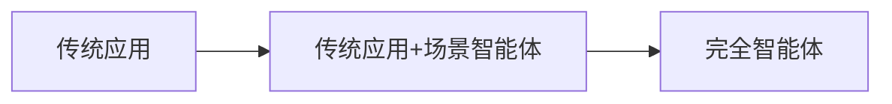

# 传统应用到智能体应用的升级改造路径

LLM时代到来后，传统的交互方式就显得落后了。新开发的产品，不能以完全智能体的方式出现，就是落后于时代的表现。

但是，老产品的智能化还不能推倒重来。

- 完全智能体的成本高，开发人员不足，开发周期长。
- 完全智能体的接受程度还不足，市场有待培育。

那么老产品要想做AI改造，最好的方法是`传统应用+场景智能体`。

建议的传统应用AI改造路线如下：

所谓场景智能体，是相对完全智能体而言的。和完全智能体不同，场景智能体旨在完成特定任务。目前流行的智能体开发平台，如dify、coze等，主要产出物基本都属于场景智能体。这类智能体有明确的目标，也会针对该目标设计固定的流程编排，并在流程编排中选用特定的模型、知识库、MCP等服务。场景智能体一般通过嵌入的方式接入传统应用中。开发和接入的成本都比较低，开发过程也和应用解耦，所以受到欢迎，并几乎成为现实标准。
