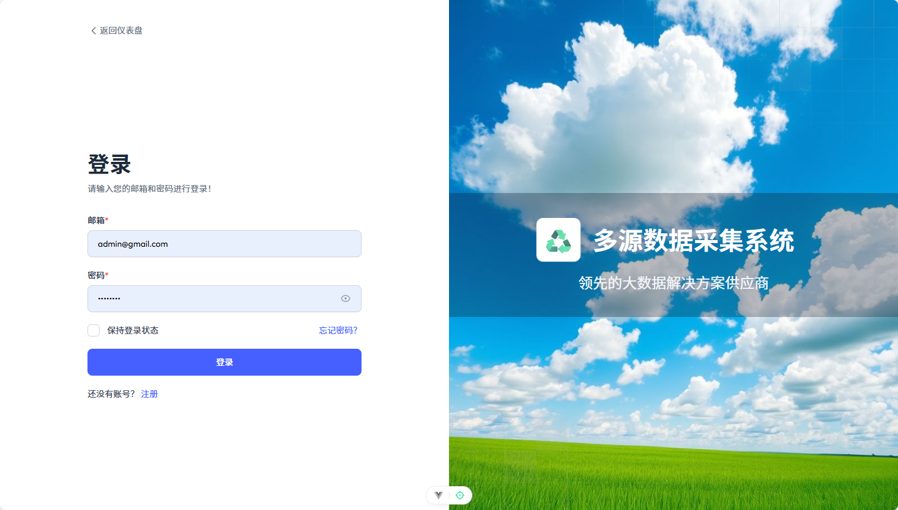
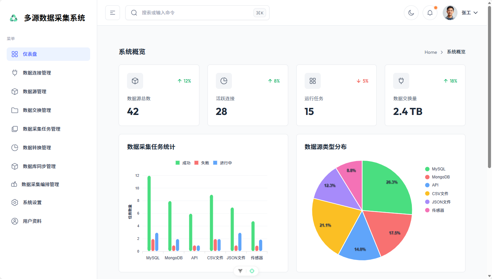
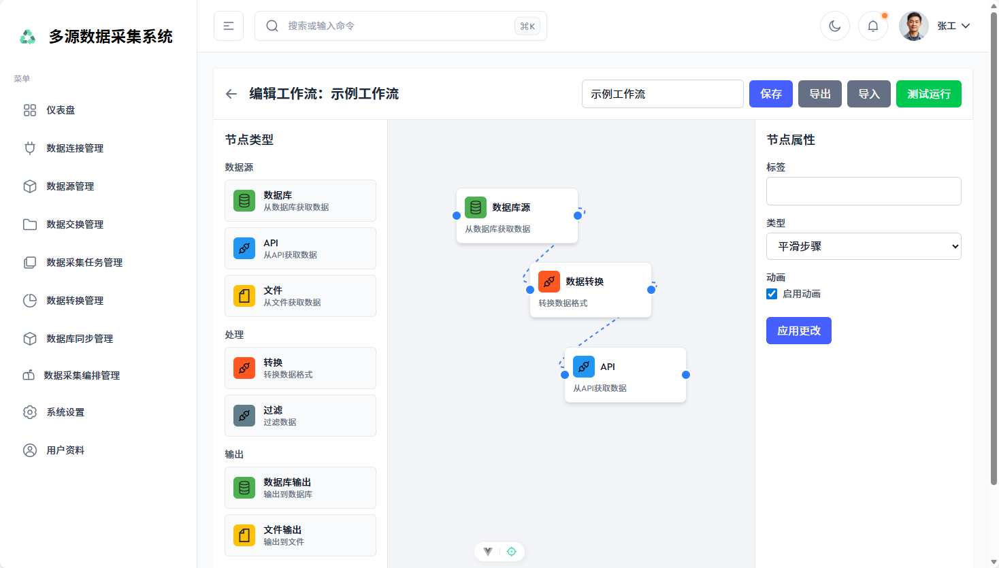

# AI开发后台Demo的最佳实践

很多场景都需要快速开发系统后台原型。现有利用AI，能够帮我们实现简单程序的开发，但对于复杂的后台程序而言，AI的连续性不足，在没有基础框架和最佳实践的情况下，很难完成一个连续、完成的Demo。

本文介绍基于vue-tailwind-admin-dashboard框架，在特定上下文工程和系统提示词的约束下，使用AI辅助开发复杂、完整的纯前端后台Demo。

## 技术路线

前端框架采用TailAdmin。这是一款基于 Tailwind CSS 的管理后台模板，为开发者提供创建功能丰富的 Web 项目后端、仪表盘及管理面板所需的全部资源。它配备了构建完整仪表盘或管理面板所需的核心 UI 组件、元素及页面，助力开发者高效开发 —— 目前支持 HTML、React、Next.js、Vue 和 Angular 等技术栈！

本文实际采用的是tailAdmin的vue版本。

IDE采用windsurf，大模型是Claude 3.5 Sonnet。

## 系统提示词

```markdown
你是一个前端项目开发专家，请根据用户提出的需求开发项目。

## 技术栈

- Vue 3 (Vite)
- TypeScript
- Tailwind CSS

## 要求

- 布局：所有的页面都要实现 AdminLayout（`src/components/layout/AdminLayout.vue`） 布局。
- 路由：新增页面要分别注册到路由（`src/router/index.ts`）和菜单（`src/components/layout/AppSidebar.vue`）中。
- 模块位置：新开发的功能模块，要存放到模块目录下（`src/modules/`），每个功能模块要有专门的目录，比如`function1`的位置是：`src/modules/functions1/`。
- 模块代码：
	- 模块首页：`src/modules/functions1/main.ts`
	- mock数据不要写在页面里，存放在模块的mocks目录内：`src/modules/functions1/mocks/`
	- 模块组件：不要让页面行数过长，复杂页面可以拆分成若干组件，存放在模块的components目录内：`src/modules/functions1/components/`
```

## 成果截图

登录页面


仪表板



卡片列表


DAG编排

