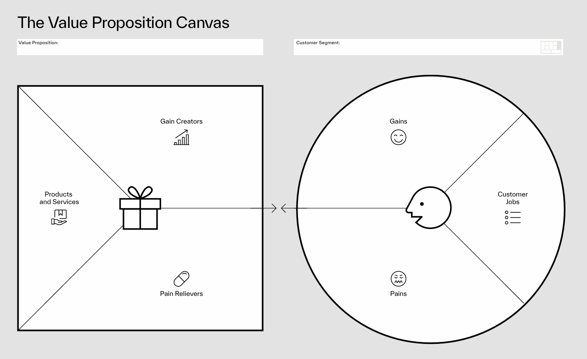

# 价值主张画布

### 价值主张画布：精准匹配产品与用户需求的核心工具  

价值主张画布（Value Proposition Canvas）是由战略管理专家亚历山大·奥斯特瓦德（Alexander Osterwalder）提出的经典商业工具，旨在帮助企业清晰定义“为谁创造价值”和“创造什么价值”，通过系统化分析实现产品与用户需求的精准匹配。  

#### **一、价值主张画布的核心结构：两大模块与六大要素**  
价值主张画布由两个相互关联的模块组成，每个模块包含具体要素，形成完整的分析框架：  

##### **1. 客户概况（Customer Profile）**  
聚焦用户需求与痛点，分为三个维度：  
- **客户工作（Jobs）**  
  - 定义：用户在特定场景下需要完成的任务或目标，包括功能性、社会性、情感性需求。  
  - 示例：上班族“快速通勤”是功能性工作，“在同事面前保持专业形象”是社会性工作，“避免迟到的焦虑”是情感性工作。  
- **痛点（Pains）**  
  - 定义：用户在完成工作时遇到的障碍或不满。  
  - 示例：通勤时“交通拥堵”“地铁拥挤”“时间不可控”等。  
- **收益（Gains）**  
  - 定义：用户期望从解决方案中获得的理想结果或积极体验。  
  - 示例：通勤时“准时到达”“行程舒适”“成本可控”等。  

##### **2. 价值主张（Value Proposition）**  
描述产品或服务如何满足用户需求，同样分为三个维度：  
- **产品和服务（Products & Services）**  
  - 定义：企业提供的具体解决方案（如实物、服务、功能等）。  
  - 示例：共享单车提供“短途代步工具”，网约车平台提供“实时叫车服务”。  
- **痛点缓解（Pain Relievers）**  
  - 定义：产品如何减少或消除用户的痛点。  
  - 示例：共享单车解决“最后一公里”通勤不便，网约车通过实时路线规划缓解“拥堵焦虑”。  
- **收益创造（Gain Creators）**  
  - 定义：产品如何为用户创造额外价值或超出预期的收益。  
  - 示例：共享单车通过“低碳出行”满足用户环保心理需求，网约车提供“舒适车型选择”提升出行体验。  

#### **二、价值主张画布的核心价值：三大应用场景**  
1. **新产品开发：从需求倒推解决方案**  
   - 通过分析用户工作、痛点、收益，确保产品设计围绕真实需求，避免“伪需求”。  
   - 案例：星巴克推出“外送星专送”时，针对用户“办公场景下快速获取咖啡”的工作，缓解“外出购买耗时”的痛点，创造“30分钟送达”的收益，精准匹配职场人群需求。  

2. **现有产品优化：识别未满足的需求**  
   - 对比价值主张与客户概况的匹配度，发现产品短板（如某痛点未被解决），针对性迭代。  
   - 案例：某办公软件发现用户“团队协作文件版本混乱”的痛点未被解决，新增“云端实时同步”功能，直接缓解痛点。  

3. **市场定位：差异化竞争策略**  
   - 通过分析竞争对手未覆盖的客户收益，打造独特价值主张。  
   - 案例：拼多多以“低价拼团”切入市场，聚焦下沉用户“用更低成本购买日用品”的工作，创造“团购优惠”的收益，与淘宝、京东形成差异化。  

#### **三、使用价值主张画布的步骤：从分析到落地**  
1. **调研用户：收集客户概况数据**  
   - 通过问卷、访谈、观察等方式，梳理用户的核心工作、痛点及收益期望（可借助用户画像工具）。  
2. **绘制价值主张：匹配需求与解决方案**  
   - 基于调研结果，填写产品功能、痛点缓解措施、收益创造点，确保三者与客户概况一一对应。  
3. **评估匹配度：检验价值主张有效性**  
   - 用“匹配度评分”（如1-5分）判断每个要素的契合度，重点优化低分项目（如某痛点未被缓解）。  
4. **迭代优化：动态调整策略**  
   - 随着用户需求变化（如市场趋势、技术升级），定期更新画布，保持价值主张的时效性。  

#### **四、经典案例：价值主张画布的实战应用**  
以“Airbnb（爱彼迎）”为例： 

| **客户概况**                                        | **价值主张**                                      |     |
| ----------------------------------------------- | --------------------------------------------- | --- |
| **客户工作**：旅行时寻找“性价比高、有本地生活体验的住宿”，同时房东希望“闲置房源变现”。 | **产品和服务**：线上平台连接旅行者与房东，提供民宿预订服务。              |     |
| **痛点**：传统酒店“价格高、体验同质化”，房东“房源空置率高、管理麻烦”。         | **痛点缓解**：民宿价格低于同地段酒店，平台提供标准化管理工具（如智能门锁、评价系统）。 |     |
| **收益**：旅行者获得“独特住宿体验、与当地人交流的机会”，房东获得“稳定收入、社交价值”。 | **收益创造**：推出“体验活动”（如房东带领游客逛本地市场），强化“沉浸式旅行”收益。  |     |

#### **五、延伸工具：与商业模式画布的结合**  
价值主张画布常与奥斯特瓦德的另一工具——**商业模式画布（Business Model Canvas）** 配合使用：  
- 价值主张画布聚焦“为用户创造什么价值”，是商业模式的核心起点；  
- 商业模式画布则扩展至“如何创造、交付、获取价值”（如渠道、客户关系、收入来源等）。  
两者结合可形成从需求定义到商业落地的完整闭环。  

#### **总结**  
价值主张画布的本质是“以用户为中心”的思维工具，通过系统化拆解需求与解决方案，帮助企业避免主观臆断，确保每一项产品功能都精准击中用户痛点。无论是创业公司打磨MVP（最小可行产品），还是成熟企业优化服务，它都是提升商业决策效率的关键方法论。

---

- [Value Proposition Canvas – Download the Official Template](https://www.strategyzer.com/library/the-value-proposition-canvas)
- [VPC-Innovation](https://4952096.fs1.hubspotusercontent-na1.net/hubfs/4952096/Assets%20-%20Downloads/The%20Value%20Proposition%20Canvas%20-%20Official%20Template%20from%20Strategyzer.pdf)
