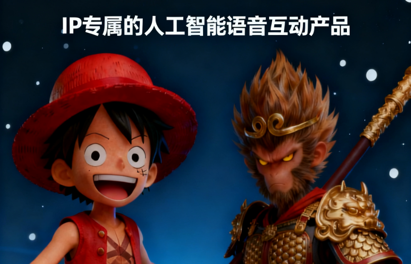

# IP专属的人工智能语音互动产品

想象一下，在你的桌子上摆着图上的这个玩偶，你问他问题，他会回答你，声音就是他的声音，甚至说话的风格都符合他的人社。
## 核心需求

其实每个人都需要一个实时在线的人工智能语音互动专用设备，但是现有智能音响（如小爱同学）太过于千篇一律，而且以功能性为主，无法提供知识服务和情绪价值。

我想可以设计一款聚焦 IP 情感连接与智能服务的创新产品：以影视动漫角色或明星偶像 IP 为核心，打造兼具 “专属人设” 与 “智能交互” 的人工智能玩偶 / 手办，打破传统智能音响功能单一、缺乏个性的局限。

## 产品描述

产品依托远端大模型实现实时语音互动，通过定制化系统提示词锚定 IP 人设，搭配专属知识库强化角色相关知识输出，再经语音大模型还原 IP 专属声线，让用户能与喜爱的动漫角色、影视人物、二次元偶像、真人明星等深度对话。它不仅是承载 IP 情怀的周边产品，更兼具双重核心价值：一方面为用户提供精准匹配 IP 人设的知识服务，解答各类问题的同时，更擅长输出角色背景、剧情关联等专属内容，还能通过共情式互动传递情绪价值。

## 商业模型

一方面可以和 IP 厂商联手推出标准化消费级产品。另一方面可以为影视动漫行业提供大模型智能体技术支持。

## 技术方案

产品构成：IP授权+玩偶手办+终端硬件+远端服务

远端服务解决新 IP 内容未纳入大模型训练语料的问题，通过上下文工程、知识库工程补全内容，搭配个性化语音定制训练，让 IP 周边实现 “活起来” 的智能升级。

硬件层面则和成熟标准化解决方案合作，降低研发门槛的同时保障产品稳定性。

玩偶手办也是标准产品了。

IP授权方面，如果商业模式选择面向C端退出消费产品，这个成本是最高的。所以前期IP的选择非常重要，要在经典和小众之间找到一款成本可控又能提供足够溢价的IP。

## 风险

该产品比较适合自身拥有大量IP和技术能力的厂商内部创业。

## IP举例

- 经典影视角色，一些大热门情景剧、超英影视等，主角鲜明的人设和治愈的友情内核，深入人心的形象，是智能互动玩偶 / 手办的完美适配对象，让屏幕里的经典角色变成触手可及的 “身边好友”。
- 日漫角色，如《海贼王》《名侦探柯南》等，主角热血坚定的信念、智慧与纯粹动人的羁绊内核，是智能互动玩偶 / 手办的优质适配对象，让二次元世界的伙伴变成朝夕相伴的 “现实挚友”。
- 游戏IP，如仙剑奇侠传、魔兽世界、王者荣耀等，，凭借丰满立体的角色形象、宏大完整的世界观与玩家深度绑定的情感羁绊，是智能互动玩偶 / 手办的优质适配对象，让游戏里的战友、侠客与英雄，变成触手可及的 “次元伙伴”。
- 幼儿 IP 玩具，如《熊出没》《奥特曼》等，引导小朋友在趣味互动中感受勇敢正义的品质、学会团结协作，让屏幕里的英雄与伙伴变成陪伴成长的 “专属良师益友”。
