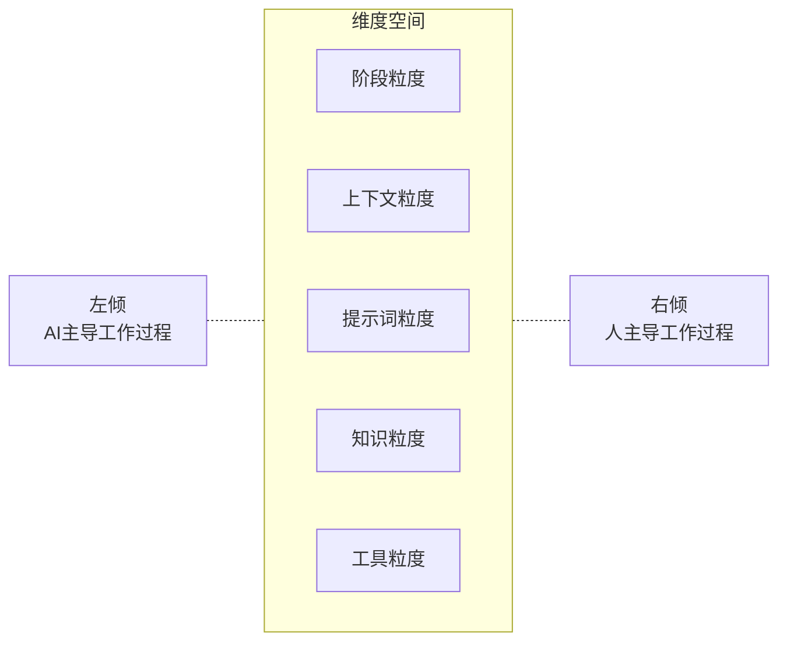

---
aliases:
  - AI辅助的两个极端和平衡
created: 2025-09-13T00:00:00.000Z
updated: 2025-09-13T00:00:00.000Z
image: ../assets/202509131504-AI辅助的两个极端和平衡.png
title: AI辅助的两个极端和平衡
datetime: '2025-09-13 15:04'
permalink: /posts/202509131504
description: null
category: 永久笔记
tags:
  - AI
prev:
  text: 如何用Obsidian实施PARA
  link: /posts/202510191233
next:
  text: 一种对文章内容生成精细控制的AI辅助写作方法
  link: /posts/202509030947
---
# AI辅助的两个极端和平衡

AI辅助工作，尤其是像写作、编程这样的大块头工作，往往有两个极端：一个是完全不信任AI，依然用传统的方式进行工作；另一个极端则是通过基础的对话，放任AI完成大部分工作。

按照管理，当一个事物有两个极端，我们通常会用左右来指代。在政治语境下，通常左代表进步，右代表保守。这里也演习这一传统。

## 左右

AI应用左倾：极端进步，完全交给AI，相信只要提供一个完整的初始化条件和足够的工具，AI就能自行完成工作，交付几乎完美的成果。

AI应用右倾：极端保守，完全由人主导整个工作流程，只把AI当作搜索引擎使用。处在和2022年ChatGPT发布之前的生产力水平。

## 是非

当我们谈到两个极端时，实际讨论的不是是非，而是平衡。但其实这个问题，也包含了是非，也包含了平衡，甚至还不是简单的平衡。

关于是非的问题，现在依然有人根本不用AI。我们每个人都在信息信息茧房中。习惯了使用AI工作的人，往往意识不到还有人竟然不用AI。你也许不信，2025年不使用AI辅助编程的人，大有人在，甚至很可能在半数以上。同样，学生不用AI辅助学习的是多数，老师不用AI辅助教学的是多数，咨询顾问不用AI写方案的也是多数。

另一个极端，认为很多工作用AI可以直接交付的，也不占少数。讽刺的是，这些人往往没有亲身体验过用AI交付完整工作。

## 平衡

平衡似乎不是一个复杂的问题。在两个极端之间，我们往往用5分法来定义个体所处在的位置：极左、温左、中间、温右、极右。

比如，作为中间派，他可能认为要适度使用AI。这和没说差不多，但其实这个认知是仪表盘的中点，是最容易划分倾向的指标。如果另一个人听他说，要适度使用AI，这个人可能会有两种相反的不满情绪：什么，仅仅是适度？不，你必须拥抱了。或者另外一种，哦，你要谨慎，这东西会把事情搞砸的。你就直到，怎么区分一个人是左倾还是右倾了。但是，你没有办法确定自己就是一个中间派，因为“适度”和没说差不多。

## 多维度

维度越多，平衡起来越复杂。这时大多数人都是中间派了。

比如，我个人是一个知识右倾的人，我提倡要尽可能的对知识进行人工精炼，尽量不要通过AI完成知识的搜集和太过自动化的索引。比如，我认为自动分块的RAG对精细化工作的价值不大。整体而言，我在每个维度都是偏保守的，但我又是一个自称要拥抱AI的人。我自认为属于偏激进的左派。

这就和在经济和政治倾向相反大有人在一样，虽然矛盾，但现实就是这么矛盾。
