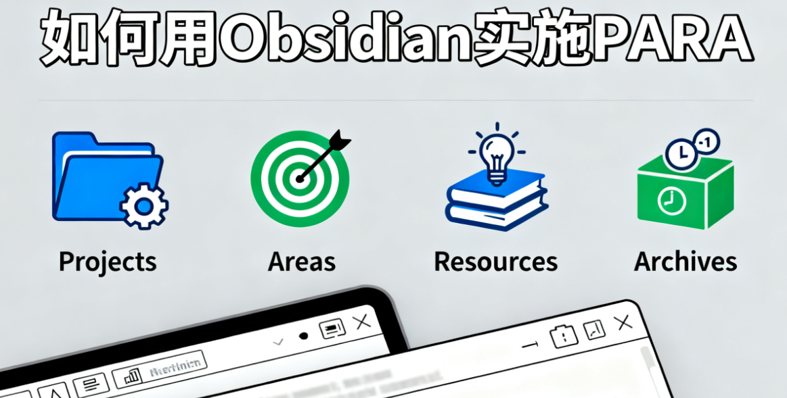

---
aliases:
  - para工作流
created: 2025-10-19T00:00:00.000Z
updated: 2025-10-19T00:00:00.000Z
image: ../assets/202510191233-如何用Obsidian实施PARA.png
title: 如何用Obsidian实施PARA
datetime: '2025-10-19 12:33'
permalink: /posts/202510191233
description: null
category: 永久笔记
tags:
  - obsidian
  - para
  - 工作效能
prev:
  text: AI辅助系统设计方案写作的几点问题
  link: /posts/202511061825
next:
  text: AI辅助的两个极端和平衡
  link: /posts/202509131504
---

# 如何用Obsidian实施PARA

The PARA Method: A Universal System for Organizing Digital Information

PARA是一种信息组织方法，同时也可以看作是一种帮助人聚焦的笔记工作流。其核心思想是用 “项目（Projects）、领域（Areas）、资源（Resources）、档案（Archives）” 四个维度，让碎片化信息变有序，适配工作、学习中的知识沉淀需求。

尝试使用Obsidian实施PARA一段时间之后，总结一下思路。
## 各维度对应Obsidian的机制

- Projects项目：在`projects目录`下，并且每个project单独建立目录。
- Areas领域 ：用`tags（标签）`机制为笔记标注areas。
- Resources资源：建立`resources目录`，随时写的内容扔到里面。可以采用zettel卡片笔记法进行分类。
- Archive档案： 建立archive目录，随时将projects中的项目目录、resources中的资源笔记移动到这里。

项目是目标。领域是约束。资源受到领域的约束，因此可以随时支持项目的开展。

这也是一个基于para的个人的context工程模型。

## 基于Obsidian的PARA写作工作流

- 识别领域。在Obsidian中，无法指定有限的标签，但是在为笔记定义标签时，Obsidian会提示已有标签。这样就需要用户在定义标签时要尽量克制，尤其在创建新标签时，考虑是否是对自己有价值的领域。
- 列出项目。将自己正在做，或计划要做的重要工作，在projects目录下创建二级目录，命名为`时间戳-项目题目`。在项目目录中可以定义`README.md`文件，作为概要和索引，并列出项目的基本信息，比如项目deadline。
- 搜集资源。搜集资源是个长期过程，尤其是领域资源需要长期维护，项目资源可以集中搜集、整理。所有资源定义好领域标签，项目资源要外链到项目。
- 项目组织。一个写作项目，首先要定义写作主旨和大纲，有了主旨和大纲就有了资料搜集和整理的方向，尤其是为项目资源的搜集整理提供了指导。内容搜集和整理可以参考卡片盒子笔记法，将笔记内容分为“闪念、文献、永久”三类，在资源目录下通常编写的是闪念和文献，在项目目录下则是永久笔记。从闪念、文献到永久笔记的工作流参考卡片盒子笔记法。
- 项目开发。按照项目组织工作流，每一张永久笔记就是项目大纲中的每个节点的内容了。将永久笔记根据大纲次序连接到一起，查缺补漏，起承转合。
