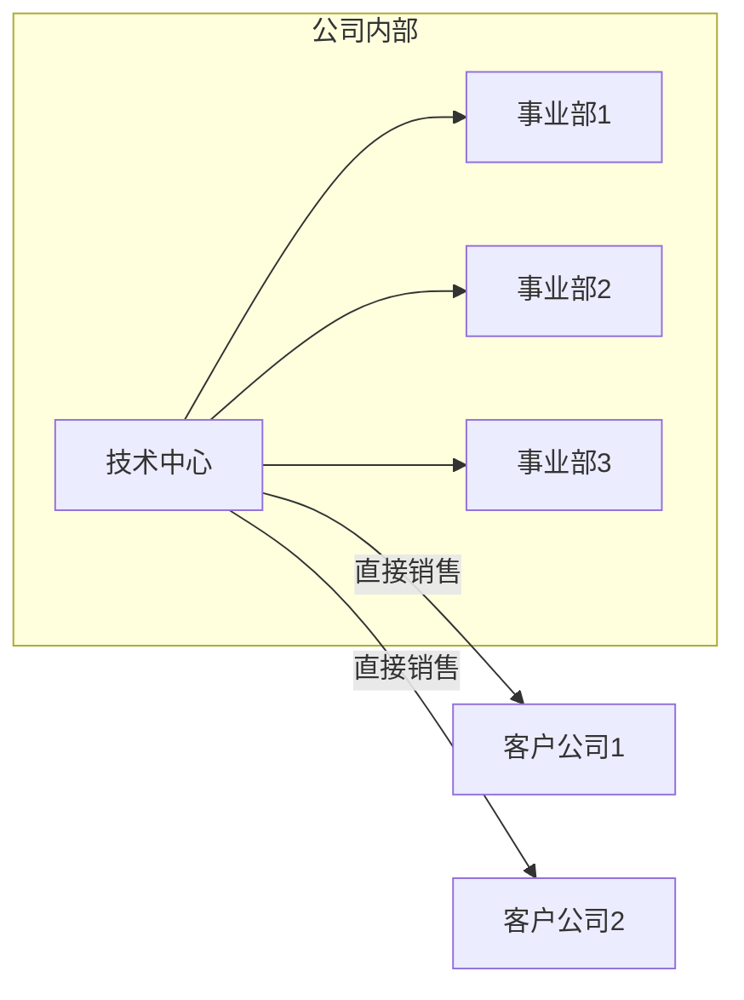

# 业务拓展需要阿米巴经营

## 阿米巴落地条件

阿米巴经营是稻盛和夫提出的一种企业管理模式，核心是将企业拆分为多个独立核算的 “阿米巴” 小集体，实现全员参与经营。

这个模式的本质是让每个部门或团队都像一家小型公司一样运作，自负盈亏，从而激发员工的经营意识和创造力。

阿米巴模式落地有两个前提：

1. 公司需有明确的业务流程和部门分工，能清晰划分出独立的 “阿米巴单元”，每个业务单元要能够独立核算。
2. 公司必须建立细粒度的数字化平台，对每个部门（业务单元）甚至个人，都提供实时、准确的指标分析工具。

其实阿米巴并不难，甚至可以说阿米巴应该是一种常态。所谓失败的公司千奇百怪，成功的公司千篇一律。在一个健康的机构，每个团队、个人都应该有机会获得业务主战场。如果一家公司业务流程混乱，各部门之间的协作不能清晰的描述出来，部门指标计算复杂，更无法独立核算，这就说明公司的玩法有问题。

## 软件技术部门如何实施阿米巴

以软件公司为例。技术部门一定是核心部门，也一定能够进行独立核算。方法就是通过提供技术产品来实现的。

有些公司的架构是技术中心+事业群。技术中心提供的是公共技术平台，这个技术平台一般情况下是不直接销售的，而是销售给事业部。各事业部再用公司提供的公共平台实现对业务需求的快速定制。当然，如果技术中心提供的产品能够有机会销售出去更好，但客户一定是技术能力较弱的软件集成商，而非直接的应用软件使用者。

是用来直接销售的，而提供给解决方案拼装项目的。任何一个行业，都无法用公司提供的基础平台解决业务问题，那各行业团队要想做好业务产品只能冒着和公司战略冲突的风险自己干技术平台。这么干能干好么？绝无可能。

之前论述过，云平台、大数据平台、服务治理平台，几乎没有市场机会。如果有市场机会，也一定动用公司最核心的力量突破，不可能由各事业部自行其是就能打下来。在平台项目上，事业部顶多算是配合方。

各团队，最大的机会在于行业业务软件。这些软件面临的可复用组件重复建设的问题，以及复杂需求变更所需要的低代码和快速开发的问题，都需要公司统一解决。公司有义务解决这些问题，才能真正实现阿米巴。

所谓公司是一个平台，个人要借助这个平台获得受益。这个平台至少要提供资质、销售网络、核心技术、业务积累、开发平台、品牌推广、客户关系等这些资源的大部分，个人和团队才能拼装自己的小部分，才能获得收益，才能实现阿米巴。
