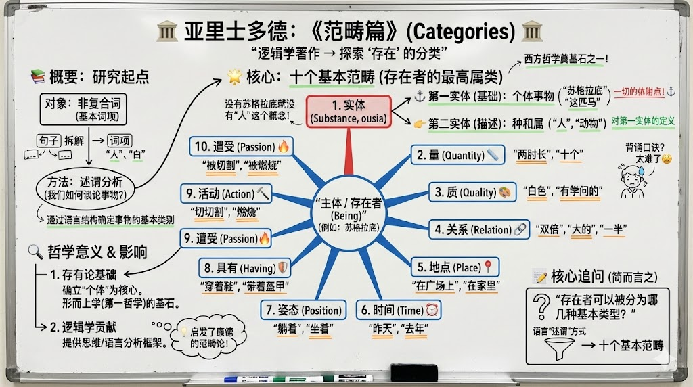

# 使用 gemini（nano banana）生成《范畴篇》白板

gemini3 pro 真的好用，生图功能升级明显。以前生成带汉字的图片基本上不可用，现在错误已经很少了。

这里提供一个使用 gemini 生成板书的工作流，供参考。

## 流程

首先要生成支撑板书图片的文本内容。其实也不是不能直接一句话生成复杂图形（用 Thinking 模式），只是这样生成的内容随机性太强，容易失去掌控。所以最佳实践一定是生成复杂的文本内容。

对大模型生成内容的修改原则有三点：1. 修正；2. 删繁；3. 加强重点。让文本内容更符合板书的写作原则。

生成板书图片，就是用系统提示词（生成图片的提示词）加上生成板书的内容提示词（文本提示词）一起扔给大模型。

## 提示词

> [!note]生成文本的提示词
> 亚里士多德的范畴篇都讲了什么？

> [!note]生成图片的提示词
> 将以下内容转换为单张白板风格的图像，宽高比为 16:9。将所有关键概念、图表、简介及关联关系分解为一目了然的形式。添加清晰的视觉注释、箭头标注、重点标记、摘要内容以及富有创意的学生式批注，以便我快速掌握全文并从中记录笔记。所有文字为中文简体。

## 附：文本内容

亚里士多德的《范畴篇》（Categories）是他的逻辑学著作之一，核心内容是对存在者的分类和规定，特别是通过分析语言中的述谓形式来确定事物的基本类别，即范畴。

**📚 主要内容概述**

探讨对象： 主要是关于“非复合词”（non-compound expressions）的体系论，即句子中最基本的词项所表示的事物。
范畴的提出： 亚里士多德通过考察我们如何谈论事物，提出了十个基本的范畴，这些范畴是存在者（being）的最高属类，是我们在逻辑上对任何事物进行“述谓”（predication）的十种基本方式。

**🌟 十个基本范畴**

这十个范畴是《范畴篇》的核心，它们是：

- 实体 (Substance, ousia)： 最基本的范畴，指的是独立存在的事物，如“一个人”、“一匹马”。它又分为：
  - 第一实体： 个体事物（如“苏格拉底”），是其他一切事物所依附的基础。
  - 第二实体： 种和属（如“人”这个种、“动物”这个属），是对第一实体的描述。
- 量 (Quantity)： 事物的大小、多少，如“两肘长”、“十个”。
- 质 (Quality)： 事物的性质、特点，如“白色”、“有学问的”。
- 关系 (Relation)： 事物之间的相互关联，如“双倍”、“一半”、“大的”。
- 地点 (Place)： 事物所处的空间位置，如“在广场上”、“在家里”。
- 时间 (Time)： 事物发生的时间，如“昨天”、“去年”。
- 姿态 (Position)： 事物的体位或姿势，如“躺着”、“坐着”。
- 具有 (Having/Possession)： 事物拥有的状态或衣着，如“穿着鞋”、“带着盔甲”。
- 活动 (Action)： 事物所做出的行为，如“切割”、“燃烧”。
- 遭受 (Passion)： 事物所承受的或被动的状态，如“被切割”、“被燃烧”。

**🔍 哲学意义**

存有论（形而上学）基础： 《范畴篇》虽然是逻辑学著作，但它通过对范畴的分类，确定了**“本体存在”（第一实体）是研究的核心对象，为他后来的形而上学**（第一哲学）奠定了基础。

逻辑学贡献： 它提供了一套关于语言述谓和思维结构的分析框架，对后世的哲学和逻辑学产生了深远影响，例如康德的范畴论就受到了它的启发。

简而言之，《范畴篇》就是亚里士多德试图回答“存在者可以被分为哪几种基本类型？”的作品，他通过对语言中“述谓”（我们谈论事物）方式的分析，给出了上述十个基本范畴。
