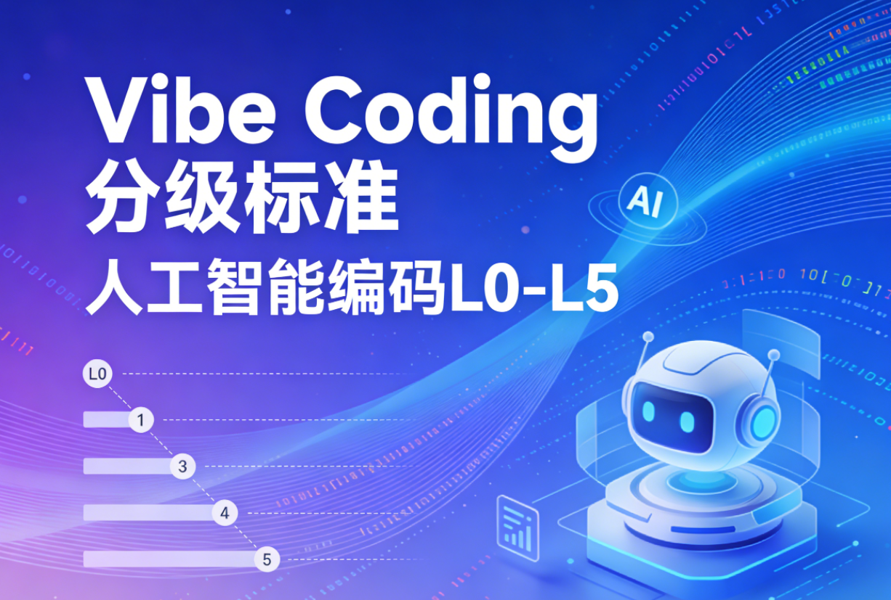

# Vibe Coding 分级标准

依托AI大模型、代码生成工具的能力演进，从纯人工开发到全AI自主完成复杂产品开发，将Vibe Coding划分为**L0至L5六个等级**，每个等级对应明确的开发模式、AI参与度和核心能力，等级越高则AI自动化程度、独立完成度越强，人工干预越少。

### L0：无自动化 · 纯人工手写代码

**核心特征**：无任何AI工具辅助，代码开发全流程由人工完成，是最基础的编码模式。

**具体表现**：从需求拆解、架构设计、代码编写、调试优化到上线部署，所有环节均依靠开发者的专业能力，手动敲写每一行代码，无智能补全、自动生成等功能加持，仅借助基础的代码编辑器（无AI插件）。

### L1：片段自动化 · AI辅助代码智能补全

**核心特征**：AI工具参与编码环节，实现**代码片段级的自动化辅助**，人工仍主导核心开发流程。

**具体表现**：开发者在编写代码时，AI工具基于输入的代码上下文、关键词，自动补全单行/多行代码、函数片段、语法模板等，解决重复编码、语法记忆等问题，大幅提升单句/片段代码的编写效率，核心逻辑、整体架构仍由人工设计和把控。

### L2：部分自动化 · AI自动开发特定组件

**核心特征**：AI工具可脱离人工片段辅助，实现**独立组件级的自动化开发**，人工主导整体架构和组件整合。

**具体表现**：开发者明确需求后，可指令AI工具自动开发单一、独立的技术组件（如登录模块、数据查询组件、前端弹窗组件、简单接口等），AI能完成该组件的完整代码编写、基础调试；人工负责整体产品的架构设计、组件划分，以及将AI生成的组件整合到项目中，处理组件间的适配问题。

### L3：条件自动化 · AI自动开发简单产品

**核心特征**：AI工具具备**简单产品级的端到端自动化开发能力**，但需在**明确、限定的条件下**实现，人工把控需求定义和结果验收。

**具体表现**：针对需求清晰、功能单一、架构简单的轻量产品（如简单的待办清单小程序、静态展示网页、基础数据统计工具、单一功能的小插件等），开发者只需精准描述产品需求和核心要求，AI可独立完成从架构设计、代码开发、基础联调到功能实现的全流程；仅在需求模糊、边界条件复杂时需要人工轻微干预，整体无需人工参与开发细节。

### L4：高度自动化 · AI自动开发复杂产品，需人工善后
**核心特征**：AI工具可独立完成**复杂产品的全流程开发**，实现产品级的高度自动化，但生成结果存在细节瑕疵，需要人工进行大量的优化、调试和善后工作。

**具体表现**：针对功能多元、架构复杂的产品（如电商小程序、管理后台系统、多模块APP等），开发者只需输入产品的核心需求和整体要求，AI可独立完成从需求拆解、架构设计、全模块开发、整体联调到产品成型的全流程；但AI生成的产品会存在细节问题（如部分功能逻辑漏洞、界面适配问题、性能瓶颈、兼容性缺陷等），需要人工进行全面的测试、调试、优化和细节完善，人工的核心工作从“开发”转为“善后优化”。

### L5：完全自动化 · AI自主开发复杂完整产品

**核心特征**：AI工具具备**无人工干预的全自动化开发能力**，可独立完成**复杂、完整、可落地的产品开发**，是Vibe Coding的最高等级。

**具体表现**：针对任意复杂程度的产品（如大型电商平台、多端协同管理系统、原生APP、复杂SaaS产品等），开发者仅需描述产品的核心诉求、业务目标和核心约束（无需精准拆解需求），AI即可自主完成**需求拆解、架构设计、全模块开发、深度调试、性能优化、兼容性适配**等全流程工作，生成的产品具备完整的功能、稳定的性能、可直接上线的落地能力，全程无需人工参与开发、调试和优化，仅需人工进行最终的结果验收。

## Vibe Coding 分级标准表

|分级|等级名称|核心特征|具体表现|
|---|---|---|---|
|L0|古法手搓 · 纯人工原生开发|无任何AI工具辅助，代码开发全流程由人工完成|从需求拆解、架构设计、代码编写、调试优化到上线部署，全环节手动完成，仅用基础代码编辑器（无AI插件），无智能辅助功能|
|L1|片段自动化 · AI辅助代码智能补全|AI工具参与编码环节，实现代码片段级自动化辅助，人工主导核心开发流程|AI基于代码上下文自动补全单行/多行代码、函数片段等，解决重复编码问题；核心逻辑、整体架构由人工设计把控，AI仅辅助片段编写|
|L2|部分自动化 · AI自动开发特定组件|AI可独立完成组件级开发，人工主导整体架构和组件整合|AI可根据指令自动开发登录模块、简单接口等单一组件（含基础调试）；人工负责架构设计、组件划分及整合，处理组件适配问题|
|L3|条件自动化 · AI自动开发简单产品|AI具备简单产品级端到端开发能力，需在明确条件下实现，人工把控需求和验收|针对待办清单、静态网页等简单轻量产品，AI可按精准需求独立完成全流程开发；仅在需求模糊时需人工轻微干预，无需参与开发细节|
|L4|高度自动化 · AI自动开发复杂产品（需人工大量善后）|AI可独立完成复杂产品全流程开发，但生成结果有瑕疵，需人工大量优化调试|AI可按核心需求完成电商小程序、管理后台等复杂产品开发；人工核心工作为测试、修复逻辑漏洞、优化性能和兼容性|
|L5|完全自动化 · AI自主开发复杂完整产品|无人工干预，AI可自主完成复杂、完整、可落地产品的全流程开发|AI可按核心诉求自主完成需求拆解、架构设计、全模块开发、深度优化等，生成产品功能完整、性能稳定，仅需人工最终验收|
