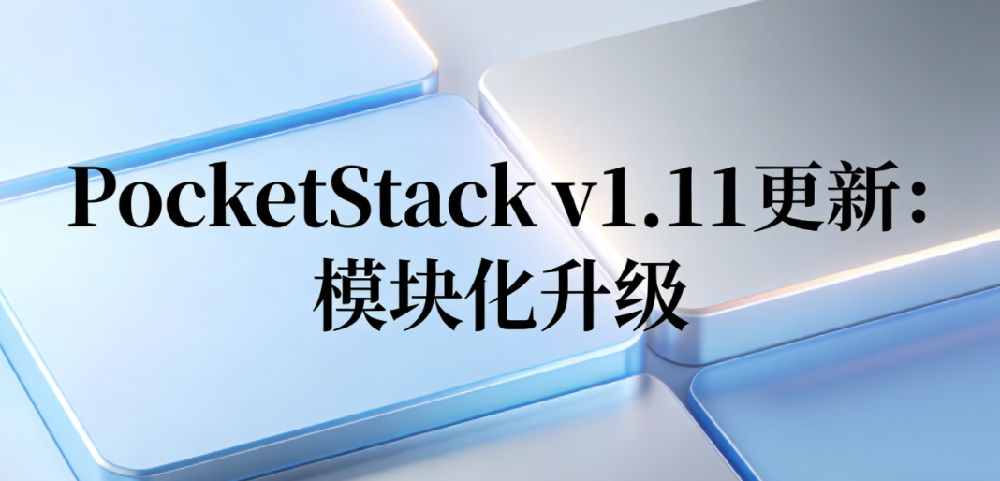

# PocketStack v1.11更新：模块化升级

模块化是 Vibe Coding 成功的重要因素。模块高内聚低耦合的特性，能有效减少不必要的上下文数量，强化大模型注意力，减少幻觉和过度泛化。在老版本的 PocketStack 中，虽然也有模块的概念，但并没有把模块和系统代码分开。本次升级，加入了模块规则，在没有特别说明的情况下，大模型会优先将用户提出的特性开发成模块。另外，也实现了菜单和路由的自动导出，只要用户将模块文件拷贝到现有项目中，就完成了安装。

## 新版模块化特性概览

- 目录位置：必须放置在 `src/modules/` 目录下。
- 自动注册导出名：路由必须导出为 `routes`，菜单必须导出为 `menu`。
- 页面命名：遵循大驼峰（如 `Products.tsx`）。
- 组件位置：模块私有组件存放在模块目录下的 `components/`。
- 路径规范：页面的访问路径通常为 `/{module}/{page}`。

## 模块结构

如果您正在开发一个新的业务模块（例如 `products`），请将其放置在 `src/modules/` 目录下。该目录下的模块支持**自动路由和菜单注册**。

请遵循以下目录结构：

```text
src/modules/products/
├── components/          # 模块私有组件
├── Products.tsx         # 主页面
├── ProductDetail.tsx    # 详情页
├── routes.tsx           # 路由配置文件 (自动注册)
└── menu.ts              # 菜单配置文件 (自动注册)
```

## 创建页面组件

在模块目录下创建页面文件，文件命名遵循**大驼峰**。

```tsx
// src/modules/products/Products.tsx
import { Card, CardContent, CardHeader, CardTitle } from '@/components/ui/card';

export function Products() {
  return (
    <div className="space-y-6">
      <h1 className="text-3xl font-bold">产品管理</h1>
      <Card>
        <CardHeader>
          <CardTitle>产品列表</CardTitle>
        </CardHeader>
        <CardContent>
          {/* 功能实现代码 */}
        </CardContent>
      </Card>
    </div>
  );
}
```

## 配置模块路由

在模块目录下创建 `routes.tsx`，导出名为 `routes` 的变量。系统会自动将其注册到主路由中。

```tsx
// src/modules/products/routes.tsx
import { Route } from 'react-router-dom';
import { Products } from './Products';

export const routes = (
  <>
    <Route path="products/list" element={<Products />} />
    {/* 其他路由... */}
  </>
);
```

> **注意**：无需在 `src/App.tsx` 中手动导入。

## 配置模块菜单

在模块目录下创建 `menu.ts`，导出名为 `menu` 的变量。系统会自动将其添加到侧边栏。

```typescript
// src/modules/products/menu.ts
import { PackageIcon } from '@heroicons/react/24/outline';

export const menu = {
  title: '产品管理',
  icon: PackageIcon,
  children: [
    { title: '产品列表', path: '/products/list' },
  ],
};
```

> **注意**：无需在 `src/components/menu.ts` 中手动导入。


---

pocket-stack: AI 友好的全栈开发解决方案：[https://github.com/citywill/pocket-stack]()

欢迎贡献、交流、加入讨论群：

