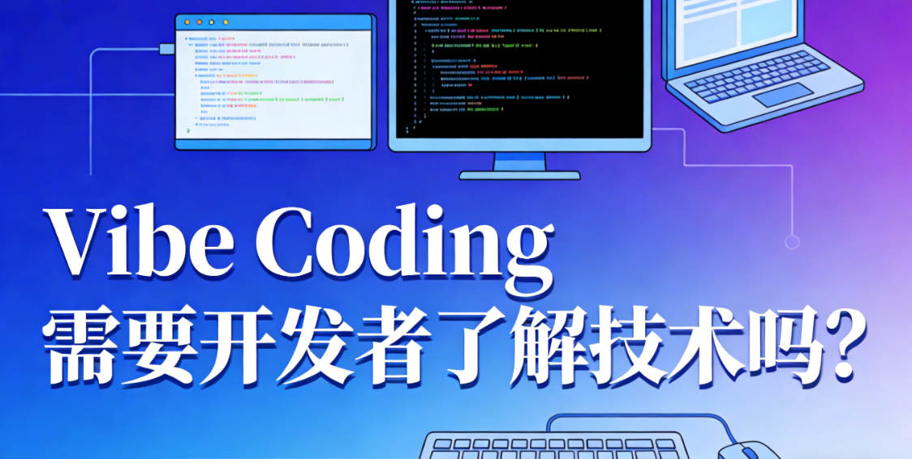

# Vibe Coding 需要开发者了解技术吗？

我们都听说过自动驾驶有L0到L5，从完全人类驾驶到完全自动化驾驶分成六个等级。

Vibe Coding其实也完全可以分级：

- L0：古法手搓
- L1：片段自动化：基于大模型代码智能补全
- L2：部分自动化：自动开发特定组件
- L3：条件自动化：自动开发简单产品
- L4：高度自动化：自动开发复杂产品，但需要人做大量善后工作
- L5：完全自动化：自动开发复杂、完整的产品

开发者需要了解多少技术，取决于你采用的工具、手段实现了哪个级别。

目前而言，我认为可以实现L4.5的 Vibe Coding。可以不会Coding，但必须要遵守4点原则：

1. 用AI友好的，而不是你喜欢或擅长的技术栈
2. 采用较为优秀的大模型（比如gml4.7、gemini3flash等）
3. 采用较为优秀的IDE（比如trae等）
4. 利用好rules、mcp、skills等通用技能（这不能算coding技术）

对，你没看错，如果用好trae cn + gml4.7，或trea国际版+gemini3flash（全是免费够用方案，即使你不懂技术，也能达到L4.5的Vibe Coding。

其中这四条最难的，就是第一条：用AI友好的技术栈。

有时候就是这么讽刺，越是懂技术的，越是排斥VibeCoding，因为懂技术的人会对技术栈有偏好，愿意用自己擅长和喜欢的技术。但对AI而言，他并不理解你的偏好，或者技术的“优雅”或“哲学”，大模型只根据自身算法和训练预料输出他认为你最想要的代码。

至于大模型的算法和语料我们也无从得出规律，我们的办法就是实验。比如，react、tailwindcss就是大家公认的AI最擅长的技术。此外还有各种前端、后端方案。经过大量实验，我总结出一套方案，给身边的产品经理等不懂技术的同事使用，完全能够开发出具备用户认证、前后端分离、增删改查、关联关系等常见特性的产品。

这套方案我开源了，欢迎各位试用，并提出宝贵意见，争取L5早日实现。

[citywill/pocket-stack: AI 友好的全栈开发解决方案。](https://github.com/citywill/pocket-stack)
