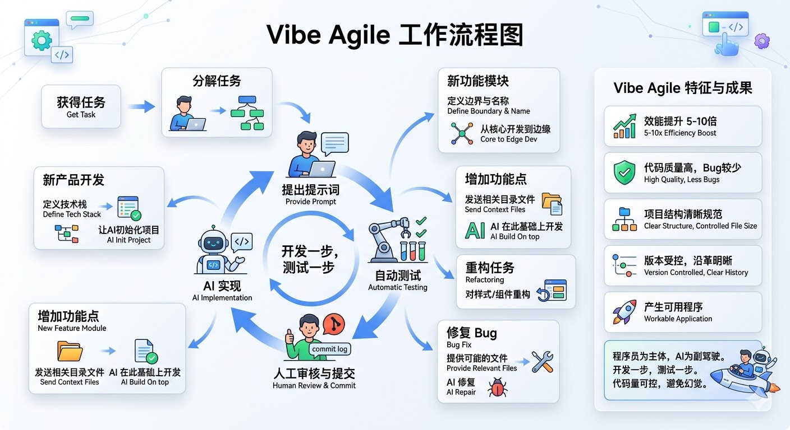
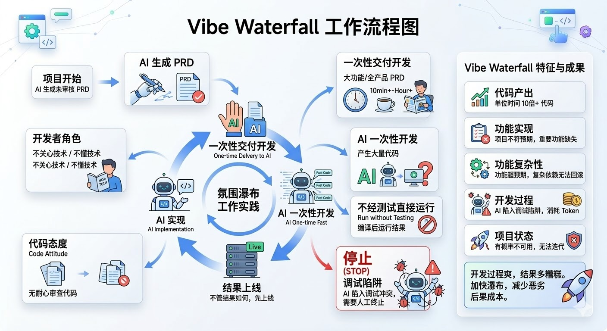

# Vibe Coding让程序员越来越浮躁了么？

vibe coding 也有很多流派。我们姑且分成两派：氛围敏捷和氛围瀑布。

### 氛围敏捷

所谓氛围敏捷，指的是当程序员获得一个任务后，会将任务分解成若干步骤，每干一步提出一个提示词，ai实现后再提出下一步的提示词。

氛围敏捷的过程往往会采用一些这样的实践：

- 当重头开发一个新产品时，程序员会先定义好技术栈，让ai帮忙初始化项目。
- 当开发一个新的功能模块时，程序员会事先定义好功能模块的名称和边界，并从核心功能开始开发，逐步开发边缘功能。
- 如果在已有功能模块的基础上增加功能点，程序员会把功能模块相关的目录、文件发给ai，让ai在此基础上开发。
- 程序员经常对ai提出重构任务，包括样式、组件和类库的封装重用等。
- 如果在已有的功能上修复bug，程序员会提供这个bug最可能所在的文件，再让ai修复。
- 当ai每完成一步开发工作后，会按照预置的规则自动测试。因为每个步骤产生的新代码较少，测试所需的上下文更可控，测试的效果会更好。

这些实践会产出符合以下特征的成果：

- 程序员的效能得以5-10倍的提升，以前一天完成的工作，现在可以在一个小时左右完成。
- 代码经过良好的测试，bug较少。
- 项目结构清晰、规范，每个文件规模受到控制，出现问题更容易调试。
- 每次产出的结果都经过人类审核的commit log提交，版本受控，沿革明晰。
- 基本能够产生可用的程序。

总之，氛围敏捷是一个人的敏捷，程序员发挥主体作用，ai作为副驾驶辅助开发和测试。要求程序员懂技术，负责任，开发一步，测试一步。这样开发，不会一次性产生大量代码，也不会由于上下文过长导致遗忘和幻觉。氛围敏捷开发中，ai是程序员的延长杆、加速器，而不是替身。

### 氛围瀑布

所谓氛围瀑布，是指直接把一个大的功能模块，甚至一个产品的prd扔给ai，让ai一次性完成产品的开发。ai开发期间，开发者可以去做别的事情，等回来的时候，程序已经上线了。

氛围瀑布经常使用的实践是这样的：

- 产品prd也是由ai生成的，并且往往没有经过足够仔细的审核。
- 开发者会将prd一次性交给ai，进入spec coding阶段。
- 开发者不关心技术，甚至可能不懂技术。
- 开发周期长，往往需要10分钟以上，甚至以小时计。开发者不用值守，会去做别的工作。
- 一次产生更多的代码，开发者不会有耐心去看这些代码，而是直接看编译后运行的结果。

氛围瀑布可能会产生这样的项目：

- 单位时间产生10倍以上的代码。
- 生成的项目可能并不符合预期，其中重要的功能可能并没有真的开发。
- 会生成一些好的功能，甚至一些功能超出程序员的预期。但也会生成一些不好的功能。这些功能之间会陷入复杂的依赖，并且无法回滚动好的版本。
- ai容易陷入调试陷阱，在多个bug之间往来冲突、反复修复，需要程序员及时发现、终止，否则token会被毫无意义的开发消耗殆尽。
- 有相当的概率不能产生可用的程序。
- 即便生成的代码可以启动，但几乎无法继续迭代。

总之，氛围瀑布和瀑布开发有惊人的相同点，那就是：开发的过程很爽，开发出来的结果有相当大概率会很糟糕。不一样的是，氛围瀑布加快了瀑布进程，当然，由于时间短，也减少了产生恶劣后果的成本。

### 更浮躁了么？

所以，并不是氛围编程让程序员更加浮躁，而是错误的氛围编程让程序员更加浮躁。当年Andrej 在提出 Vibe Coding 概念的时候，举的例子是“让侧边栏的内边距减少一半”，但现在大家期待用Vibe Coding开发“百万额度企业级应用开发”的工作，再把程序员数量减少一半。

所以，LLM的时代，不是程序员浮躁了，而是那些藏在桶里跳瀑布的人又回来了。

### 解决方案

1. 把开发主体还给程序员，包括对主体的尊重。
2. 程序员要放弃一些骑术，转而学习开车。但开车并非不需要技术，甚至需要更多的技术。
3. 在软件的底层范式升级前，开发的模式也不会发生太大变化，ai仍然要当作加速器使用。
4. 避免使用长程agent进行开发，spec可以作为上下文，但不能作为当甩手掌柜的借口。
5. 敏捷没死。甚至还应该更加敏捷。
6. 使用ai友好的技术栈，比如[Pocketstack](https://github.com/citywill/pocket-stack)。