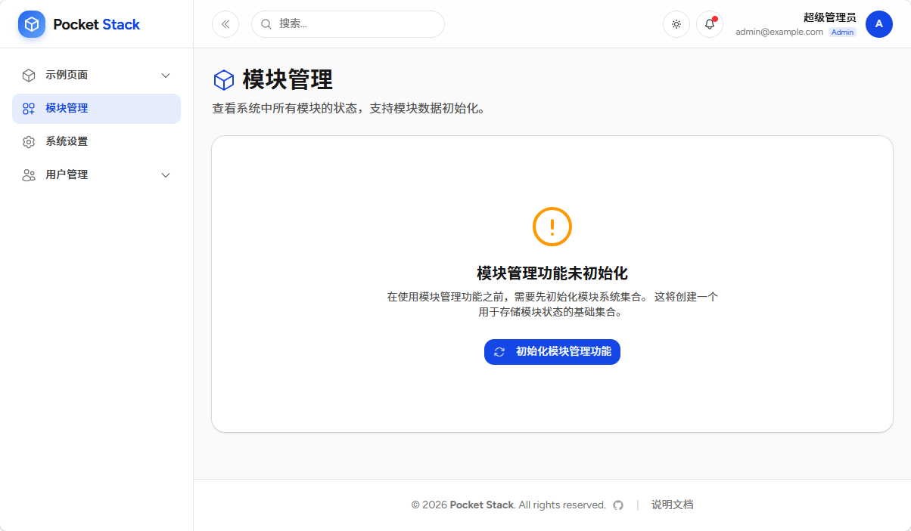
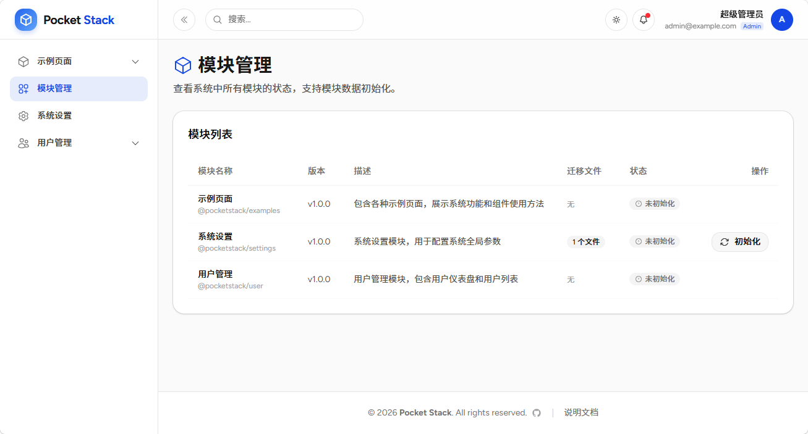

# PocketStack的模块化设计2.0：Vibe Coding时代的架构优先实践

## Vibe Coding时代：架构设计高于代码实现

用 Vibe Coding 开发过真实项目的同学肯定体验过，当项目规模不断扩大，AI编码过程的上下文不断蔓延，AI搞出来的小技术债将涌现成死结。

我访问过很多同行，大家都认可一个共识：在 Vibe Coding 的过程中，架构设计高于代码实现。代码实现可以交给AI，但架构设计必须由人主导。好的架构为AI划定清晰边界、提供有限的上下文，让生成的代码可复用、可扩展、可维护。模块化，正是应对这一变革的最优解。

## PocketStack模块化2.0：开箱即用的前端模块化体系

PocketStack 的新版模块以**插件化、独立性、单一职责**为核心，利用Node.js的单体仓库（workspace）特性和React的动态导入机制实现，实现模块和框架完全解耦，可以各自开发、一键集成的效果。

### 1. 核心设计理念
- **约定优于配置**：按统一规范放置文件，提供 agent rules，AI原生友好。
- **依赖独立**：每个模块有完整的包定义、数据迁移、路由、菜单、组件文件，通过动态导入机制实现插件化自动注册。只要把模块目录放置到`src/modules`下，系统即可自动识别并加载。
- **前后端一体化**：前端模块自动对接PocketBase集合，数据层无需重复开发，模块之间不共用types定义，不会导致模型层膨胀。

### 2. 标准模块结构（自动识别）
所有模块统一存放于`src/modules/[模块名]`，系统自动扫描注册：
```text
src/modules/[module]
├── package.json    # 模块元信息（自动纳入模块管理）
├── routes.tsx      # 路由定义（自动注册）
├── menu.ts         # 侧边栏菜单（自动挂载）
├── [Page].tsx      # 页面组件（大驼峰命名）
├── components/     # 模块私有组件
└── migrations/     # 数据库迁移文件（可选）
```

### 3. 关键机制详解

#### （1）模块包定义：模块级依赖管理

模块的定义和依赖要注册到模块的`package.json`文件中，实现模块的包依赖不需要全局注册，方便模块的插件式管理、迁移和集成。

```json
{
  "name": "@pocketstack/examples",
  "version": "1.0.0",
  "title": "示例页面",
  "description": "展示系统功能与组件用法",
  "private": true,
  "type": "module",
  "peerDependencies": {
    "react": "^19.0.0",
    "react-dom": "^19.0.0"
  }
}
```


#### （2）自动路由：无需侵入主应用

通过`routes.tsx`导出`routes`变量，系统自动合并到主路由，支持登录保护、后台布局：

```tsx
import { Route } from 'react-router-dom';
import { ProtectedRoute, MainLayout } from '@/components';

export const routes = (
  <>
    <Route element={<ProtectedRoute />}>
      <Route path="/examples/dashboard" element={<ExampleDashboard />} />
      <Route path="/examples/table" element={<ExampleTable />} />
    </Route>
  </>
);
```


#### （3）自动菜单：自动挂载侧边栏

`menu.ts`导出`menu`对象，自动加入左侧导航，支持图标、子菜单、外部链接：

```typescript
import { CubeIcon } from '@heroicons/react/24/outline';
export const menu = {
  title: '示例页面',
  icon: CubeIcon,
  children: [
    { title: '仪表盘', path: '/examples/dashboard' },
    { title: '表格示例', path: '/examples/table' }
  ]
};
```


#### （4）系统级模块管理：中心化控制

PocketStack 提供了模块管理功能，使用超级管理员登录后可以使用。

点击页面侧边栏 `模块管理` 菜单，点击 `初始化模块管理功能` 按钮。模块管理也是一个特殊的模块，只有先初始化该模块，才能对其它模块进行管理。初始化的主要工作是完成数据迁移（向 PocketBase 导入模块所需的集合）。



初始化完成后，既可以看到系统目前安装的所有模块。有一些模块需要初始化才能正常使用。比如`系统设置`模块就需要初始化，而`示例页面`模块则不需要初始化。



### 4. 官方内置模块（开箱即用）

| 模块 | 包名 | 核心能力 | 权限 |
| :--- | :--- | :--- | :--- |
| 示例页面 | @pocketstack/examples | 仪表盘、表格、表单、AI对话、CRUD、Markdown编辑器 | 公开 |
| 系统设置 | @pocketstack/settings | 全局配置、插件式表单扩展、system_settings集合 | 仅管理员 |
| 用户管理 | @pocketstack/user | 用户仪表盘、列表、增删改查、头像上传 | 仅管理员 |

## 三、模块化2.0给Vibe Coding带来的核心价值
PocketStack模块化不是“锦上添花”，而是**让Vibe Coding从玩具变成生产级工具**的关键支撑，解决AI开发的本质痛点。

### 1. 为AI划定稳定边界，杜绝架构混乱
Vibe Coding最大风险是AI无边界生成代码，导致项目“乱炖”。PocketStack通过**模块边界、文件规范、导出约定**，让AI只在指定模块内生成代码，不污染全局架构，从根源避免技术债。

### 2. 缩小AI上下文，提升生成质量
大模型在小而清晰的上下文里表现更稳定。模块化将复杂系统拆分为独立小模块，开发者只需聚焦当前模块需求，AI生成的代码更精准、更少幻觉，迭代效率指数级提升。

### 3. 复用模块资产，加速AI开发
内置的用户管理、系统设置、CRUD示例等模块，可直接作为AI生成模板。开发者无需从零描述需求，只需基于现有模块微调，大幅降低Token成本，快速落地业务功能。

### 4. 支持渐进式开发，适配氛围敏捷
氛围敏捷强调快速原型、持续迭代。PocketStack支持**先开发核心功能 → 再扩展其他功能**，完美匹配“原型即前端、前端既应用”的AI开发流程，兼顾速度与工程质量。

### 5. 降低协作成本，团队高效协同
模块清晰的职责与接口，让多人协作不再冲突。不同开发者可并行开发不同模块，AI生成的代码互不干扰，上线、维护、排查问题更高效，真正实现**架构统一、开发自由**。

## 四、总结
在Vibe Coding时代，**代码不再是核心竞争力，架构能力才是**。PocketStack模块化2.0通过约定化、自动化、低耦合的设计，为AI开发提供稳定骨架：既释放AI快速生成的效率优势，又守住企业级应用的可维护性底线。
